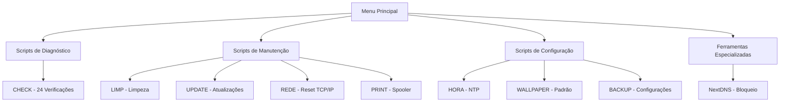

# 🧰 HP Scripts - Documentação Técnica

Kit profissional de **automação, diagnóstico e manutenção de sistemas Windows**, voltado para **técnicos de informática**, **assistências técnicas** e **ambientes corporativos**.

---

## 🚀 Execução Rápida

### Menu Principal

```powershell
irm https://get.hpinfo.com.br/menu | iex
```

Este comando abre um menu interativo com acesso a todas as ferramentas do projeto.

---

## 📦 O que este projeto entrega

✅ **Diagnóstico técnico automatizado** - 24 verificações completas do sistema  
✅ **Correção de falhas comuns** - Reset de rede, impressão, Windows Update  
✅ **Padronização pós-formatação** - Backup e restore de configurações  
✅ **Score de performance** - Medição antes e depois da manutenção  
✅ **Relatórios profissionais** - HTML com gráficos e recomendações  

---

## 🛠️ Catálogo de Scripts

### Scripts Principais

| Script | Função | Execução Rápida |
|--------|--------|-----------------|
| **[CHECK](scripts/check.md)** | Diagnóstico completo (24 verificações) | `irm get.hpinfo.com.br/check \| iex` |
| **[BACKUP](scripts/backup.md)** | Backup de Wi-Fi, rede e softwares | `irm get.hpinfo.com.br/backup \| iex` |
| **[LIMP](scripts/limp.md)** | Limpeza profunda do sistema | `irm get.hpinfo.com.br/limp \| iex` |
| **[UPDATE](scripts/update.md)** | Reparo e instalação de atualizações | `irm get.hpinfo.com.br/update \| iex` |
| **[HORA](scripts/hora.md)** | Sincronização de horário NTP | `irm get.hpinfo.com.br/hora \| iex` |
| **[REDE](scripts/rede.md)** | Reset completo de rede | `irm get.hpinfo.com.br/net \| iex` |
| **[PRINT](scripts/print.md)** | Reparo de impressão | `irm get.hpinfo.com.br/print \| iex` |
| **[WALLPAPER](scripts/wall.md)** | Aplicar wallpaper corporativo | `irm get.hpinfo.com.br/wallpaper \| iex` |

### Ferramentas

| Ferramenta | Função | Execução Rápida |
|------------|--------|-----------------|
| **[NextDNS](scripts/nextdns.md)** | Bloqueio e filtragem de conteúdo | `irm get.hpinfo.com.br/tools/nextdns/nextdns \| iex` |
| **[Menu](scripts/menu.md)** | Hub de automação principal | `irm get.hpinfo.com.br/menu \| iex` |

---

## 🏗️ Arquitetura do Projeto



---

## 💡 Características Principais

### Execução Remota

Todos os scripts podem ser executados diretamente da internet sem necessidade de download:

```powershell
irm https://get.hpinfo.com.br/[script] | iex
```

### Compatibilidade

- ✅ Windows 7, 8, 10, 11
- ✅ PowerShell 2.0+ (fallback automático via WMI)
- ✅ PowerShell 5.1+ recomendado para melhor performance
- ✅ Detecção automática de privilégios

### Segurança

- ✅ Scripts assinados e verificáveis
- ✅ Código-fonte aberto no GitHub
- ✅ Sem instalação permanente
- ✅ Execução temporária (scripts deletados após uso)

---

## 📚 Documentação

### Para Começar

- **[Acesso Rápido](quickstart.md)** - Guia rápido de início
- **[Requisitos](requisitos.md)** - Requisitos de sistema
- **[Segurança](seguranca.md)** - Política de segurança e avisos

### Scripts Principais

Cada script possui documentação técnica completa incluindo:

- Arquitetura e fluxo de execução
- Métodos técnicos utilizados
- Exemplos de código
- Troubleshooting detalhado
- Casos de uso práticos

### Ferramentas

- **[NextDNS](scripts/nextdns.md)** - Instalação, configuração e auto-reparo
- **[PowerShell 7](utilitarios/installps1.md)** - Instalador automático

---

## 🎯 Casos de Uso

### Manutenção Completa

```powershell
# 1. Diagnóstico
irm get.hpinfo.com.br/check | iex

# 2. Limpeza
irm get.hpinfo.com.br/limp | iex

# 3. Atualizações
irm get.hpinfo.com.br/update | iex

# 4. Verificação final
irm get.hpinfo.com.br/check | iex
```

### Pré-Formatação

```powershell
# Backup completo
irm get.hpinfo.com.br/backup | iex

# Copiar C:\Intel para pendrive
```

### Pós-Formatação

```powershell
# 1. Instalar PowerShell 7
irm get.hpinfo.com.br/installps1.cmd | cmd

# 2. Configurar horário
irm get.hpinfo.com.br/hora | iex

# 3. Aplicar wallpaper
irm get.hpinfo.com.br/wallpaper | iex

# 4. Restaurar backup
C:\Intel\restore.ps1
```

### Resolução de Problemas

```powershell
# Sem internet
irm get.hpinfo.com.br/net | iex

# Impressora não funciona
irm get.hpinfo.com.br/print | iex

# Windows Update travado
irm get.hpinfo.com.br/update | iex
```

---

## 🤝 Contribuindo

Contribuições são bem-vindas! Veja nosso [guia de contribuição](https://github.com/sejalivre/hp-scripts/blob/main/CONTRIBUTING.md).

---

## 📞 Suporte

- **Documentação**: [docs.hpinfo.com.br](https://docs.hpinfo.com.br)
- **GitHub**: [github.com/sejalivre/hp-scripts](https://github.com/sejalivre/hp-scripts)
- **Issues**: [Reportar problema](https://github.com/sejalivre/hp-scripts/issues)
- **Site**: [hpinfo.com.br](https://hpinfo.com.br)

---

## ⚖️ Licença

[MIT License](licenca.md) - Uso livre para fins comerciais e não comerciais.

---

<div align="center">

**Desenvolvido por HP Info** | [hpinfo.com.br](https://hpinfo.com.br)

[](https://github.com/sejalivre/hp-scripts)
[](https://docs.hpinfo.com.br)

</div>