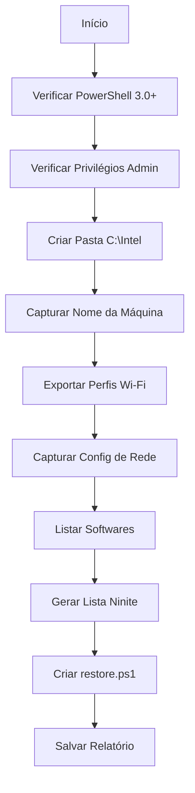

# 💾 BACKUP - Sistema de Backup e Migração

## Visão Geral

O **backup.ps1** é um script inteligente que captura configurações essenciais do Windows antes de formatações ou migrações, incluindo perfis Wi-Fi com senhas, configurações de rede, softwares instalados e geração automática de script de restauração.

## Execução Rápida

```powershell
irm https://get.hpinfo.com.br/backup | iex
```

---

## Arquitetura do Sistema

### Fluxo de Execução



### Estrutura de Arquivos Gerados

```
C:\Intel\
├── RelatorioSistema.txt          # Relatório completo
├── restore.ps1                    # Script de restauração automática
└── WiFiProfiles\                  # Perfis Wi-Fi exportados
    ├── Wi-Fi-SSID1.xml
    ├── Wi-Fi-SSID2.xml
    └── ...
```

---

## Funcionalidades Detalhadas

### 1. Exportação de Perfis Wi-Fi

#### Listagem de Perfis

```powershell
$profileLines = netsh wlan show profiles 2>&1

# Parsing de nomes de perfis
foreach ($line in $profileLines) {
    if ($line -match ':\s*(.+)$') {
        $name = $matches[1].Trim()
        if ($name -and $name -ne '<Nenhum>') {
            $wifiProfiles += $name
        }
    }
}
```

#### Exportação com Senhas

```powershell
# Exporta cada perfil para XML com senha em texto claro
foreach ($profile in $wifiProfiles) {
    netsh wlan export profile name="$profile" folder="$wifiExportPath" key=clear
}
```

#### Parsing de Senhas dos XMLs

```powershell
$xmlFiles = Get-ChildItem -Path $wifiExportPath -Filter "*.xml"
foreach ($xmlFile in $xmlFiles) {
    [xml]$xml = Get-Content $xmlFile.FullName -Encoding UTF8
    $name = $xml.WLANProfile.name
    $pass = $xml.WLANProfile.MSM.security.sharedKey.keyMaterial
    
    $wifiInfo += "Rede: $name`nSenha: $pass`n`n"
}
```

**Formato XML do Perfil Wi-Fi**:
```xml
<?xml version="1.0"?>
<WLANProfile xmlns="http://www.microsoft.com/networking/WLAN/profile/v1">
    <name>MinhaRede</name>
    <SSIDConfig>
        <SSID>
            <name>MinhaRede</name>
        </SSID>
    </SSIDConfig>
    <connectionType>ESS</connectionType>
    <connectionMode>auto</connectionMode>
    <MSM>
        <security>
            <authEncryption>
                <authentication>WPA2PSK</authentication>
                <encryption>AES</encryption>
            </authEncryption>
            <sharedKey>
                <keyType>passPhrase</keyType>
                <protected>false</protected>
                <keyMaterial>SenhaAqui123</keyMaterial>
            </sharedKey>
        </security>
    </MSM>
</WLANProfile>
```

---

### 2. Captura de Configurações de Rede

#### Detecção de Interfaces

```powershell
$netConfigs = Get-NetIPConfiguration -ErrorAction Stop | 
    Where-Object { $_.InterfaceAlias -match 'Wi-Fi|Ethernet|WiFi' }
```

#### Identificação de IP Estático vs DHCP

```powershell
foreach ($config in $netConfigs) {
    $alias = $config.InterfaceAlias
    $dhcpEnabled = (Get-NetIPInterface -InterfaceAlias $alias -AddressFamily IPv4).Dhcp -eq 'Enabled'
    
    if (-not $dhcpEnabled -and $ipConfig.IPv4Address.IPAddress) {
        # IP Estático detectado - salvar configuração
        $ip = $ipConfig.IPv4Address.IPAddress
        $prefix = $ipConfig.IPv4Address.PrefixLength
        $gw = $ipConfig.IPv4DefaultGateway.NextHop
        $dns = $ipConfig.DNSServer.ServerAddresses
    }
}
```

#### Geração de Comandos de Restore

```powershell
$netRestoreCommands += "New-NetIPAddress -InterfaceAlias '$alias' -IPAddress '$ip' -PrefixLength $prefix -DefaultGateway '$gw'"
$netRestoreCommands += "Set-DnsClientServerAddress -InterfaceAlias '$alias' -ServerAddresses $dns"
```

---

### 3. Listagem de Softwares Instalados

#### Coleta de Múltiplos Registros

```powershell
$apps = @()

# Registro 64-bit
$apps += Get-ItemProperty "HKLM:\Software\Microsoft\Windows\CurrentVersion\Uninstall\*" | 
    Where-Object DisplayName | 
    Select-Object DisplayName, DisplayVersion, Publisher

# Registro 32-bit (em sistemas 64-bit)
$apps += Get-ItemProperty "HKLM:\Software\Wow6432Node\Microsoft\Windows\CurrentVersion\Uninstall\*" | 
    Where-Object DisplayName | 
    Select-Object DisplayName, DisplayVersion, Publisher

# Remove duplicatas
$apps = $apps | Sort-Object DisplayName -Unique
```

---

### 4. Integração com Ninite

#### Lista de Softwares Suportados

```powershell
$niniteSupported = @(
    "7-Zip", "Adobe Acrobat", "AnyDesk", "Audacity", "Brave", "CCleaner", 
    "Chrome", "Discord", "Dropbox", "Everything", "FileZilla", "Firefox", 
    "Foxit Reader", "GIMP", "Git", "Google Drive", "Greenshot", "HandBrake", 
    "Inkscape", "IrfanView", "Java", "KeePass", "Krita", "LibreOffice", 
    "Malwarebytes", "Notepad++", "OneDrive", "Paint.NET", "PuTTY", "Python", 
    "qbittorrent", "ShareX", "Spotify", "Steam", "SumatraPDF", "TeamViewer", 
    "Thunderbird", "VLC", "VS Code", "WinDirStat", "WinSCP", "Zoom"
)
```

#### Matching Inteligente

```powershell
$appsForNinite = $apps | Where-Object {
    $dn = $_.DisplayName -replace '\s*\(.*?\)|\ s*-\s*.*$', '' -replace '\s+$', ''
    $niniteSupported -contains $dn -or $niniteSupported -match [regex]::Escape($dn)
} | ForEach-Object { 
    $_.DisplayName -replace '\s', '+' -replace '[^a-zA-Z0-9+]', '' 
} | Sort-Object -Unique
```

#### Geração de URL Ninite

```powershell
$niniteAppsParam = $appsForNinite -join '&'
$niniteUrl = "https://ninite.com/$niniteAppsParam/ninite.exe"
```

**Exemplo de URL gerada**:
```
https://ninite.com/chrome&firefox&vlc&7zip&notepadplusplus/ninite.exe
```

---

## Script de Restauração Automática

### Estrutura do restore.ps1

```powershell
# restore.ps1 - Gerado automaticamente pelo backup.ps1

# 1. Verificar privilégios de administrador
if (-not ([Security.Principal.WindowsPrincipal][Security.Principal.WindowsIdentity]::GetCurrent()).IsInRole([Security.Principal.WindowsBuiltInRole]::Administrator)) {
    Write-Host 'Execute como ADMINISTRADOR!' -ForegroundColor Red
    pause
    exit
}

# 2. Restaurar hostname
Rename-Computer -NewName 'NOME-ORIGINAL' -Force -Restart:$false

# 3. Restaurar configurações de IP estático (se aplicável)
New-NetIPAddress -InterfaceAlias 'Ethernet' -IPAddress '192.168.1.100' -PrefixLength 24 -DefaultGateway '192.168.1.1'
Set-DnsClientServerAddress -InterfaceAlias 'Ethernet' -ServerAddresses '8.8.8.8','8.8.4.4'

# 4. Importar perfis Wi-Fi
$wifiPath = 'C:\Intel\WiFiProfiles'
Get-ChildItem -Path $wifiPath -Filter '*.xml' | ForEach-Object {
    netsh wlan add profile filename="$($_.FullName)"
}

# 5. Abrir Ninite com apps detectados
Start-Process 'https://ninite.com/chrome&firefox&vlc/ninite.exe'
```

---

## Relatório Gerado

### Formato do RelatorioSistema.txt

```
=== Nome da Máquina ===
DESKTOP-ABC123

=== Configurações de Rede ===
InterfaceAlias       : Ethernet
IPv4Address          : 192.168.1.100
IPv4DefaultGateway   : 192.168.1.1
DNSServer            : 8.8.8.8, 8.8.4.4

=== Perfis WiFi (Nomes e Senhas) ===
Rede: MinhaRede
Senha: senha123

Rede: RedeTrabalho
Senha: trabalho456

=== Perfis WiFi Exportados ===
Exportados: 2
Pasta: C:\Intel\WiFiProfiles

=== Softwares Instalados ===
DisplayName                    DisplayVersion    Publisher
-----------                    --------------    ---------
Google Chrome                  120.0.6099.109    Google LLC
Mozilla Firefox                121.0             Mozilla
VLC media player               3.0.20            VideoLAN
7-Zip 23.01 (x64)             23.01             Igor Pavlov

=== Pastas Compartilhadas ===
Name    Path              Description
----    ----              -----------
C$      C:\               Default share
IPC$                      Remote IPC

=== Impressoras Instaladas ===
Name                     DriverName                    PortName
----                     ----------                    --------
HP LaserJet Pro M404     HP LaserJet Pro M404 PCL 6    USB001
Microsoft Print to PDF   Microsoft Print To PDF        PORTPROMPT:

=== Relatório gerado em: 27/01/2026 01:45:00 ===
```

---

## Compatibilidade

### Requisitos Mínimos

- Windows 8+ (PowerShell 3.0+)
- Privilégios de Administrador
- Adaptador Wi-Fi (opcional, para exportação de perfis)

### Fallbacks Implementados

#### Verificação de Adaptador Wi-Fi

```powershell
if ($profileLines -match "não há nenhuma interface|no wireless|AutoConfig.*not running") {
    Write-Host "Aviso: Nenhum adaptador Wi-Fi encontrado" -ForegroundColor Yellow
    $wifiProfiles = @()
}
```

#### Tratamento de Erros de Rede

```powershell
try {
    $netConfigs = Get-NetIPConfiguration -ErrorAction Stop
}
catch {
    Write-Host "Aviso: Não foi possível obter configurações de rede" -ForegroundColor Yellow
    Add-Section "Configurações de Rede" "Erro: $($_.Exception.Message)"
    $netConfigs = @()
}
```

---

## Casos de Uso

### 1. Backup Pré-Formatação

```powershell
# Executar antes de formatar
irm https://get.hpinfo.com.br/backup | iex

# Copiar pasta C:\Intel para pendrive ou nuvem
Copy-Item "C:\Intel" "D:\Backup-PC-$(Get-Date -Format 'yyyyMMdd')" -Recurse
```

### 2. Migração de PC

```powershell
# No PC antigo
irm https://get.hpinfo.com.br/backup | iex

# Transferir C:\Intel para novo PC
# No PC novo (após Windows instalado)
C:\Intel\restore.ps1
```

### 3. Documentação de Cliente

```powershell
# Gerar relatório para documentação
irm https://get.hpinfo.com.br/backup | iex

# Enviar C:\Intel\RelatorioSistema.txt para cliente
```

---

## Troubleshooting

### Erro: "Execute como ADMINISTRADOR"

**Causa**: Script não está rodando com privilégios elevados

**Solução**:
```powershell
# Clicar direito no PowerShell → Executar como Administrador
# Ou usar:
Start-Process powershell -Verb runAs -ArgumentList "-File backup.ps1"
```

### Erro: "Nenhum perfil Wi-Fi encontrado"

**Causa**: Serviço WLAN AutoConfig desabilitado ou sem adaptador Wi-Fi

**Solução**:
```powershell
# Verificar serviço
Get-Service -Name WlanSvc

# Iniciar se necessário
Start-Service -Name WlanSvc
```

### Ninite não abre ou URL vazia

**Causa**: Nenhum software compatível detectado

**Solução**: URL padrão `https://ninite.com/` será aberta para seleção manual

---

## Segurança

### Senhas em Texto Claro

⚠️ **AVISO**: As senhas Wi-Fi são exportadas em **texto claro** nos arquivos XML.

**Recomendações**:
1. Proteger pasta `C:\Intel` com permissões NTFS
2. Criptografar backup antes de transferir
3. Deletar arquivos após restauração

```powershell
# Proteger pasta (somente administrador)
$acl = Get-Acl "C:\Intel"
$acl.SetAccessRuleProtection($true, $false)
$rule = New-Object System.Security.AccessControl.FileSystemAccessRule("Administrators","FullControl","Allow")
$acl.AddAccessRule($rule)
Set-Acl "C:\Intel" $acl
```

---

## Código-Fonte

[Ver código completo no GitHub](https://github.com/sejalivre/hp-scripts/blob/main/backup.ps1)
