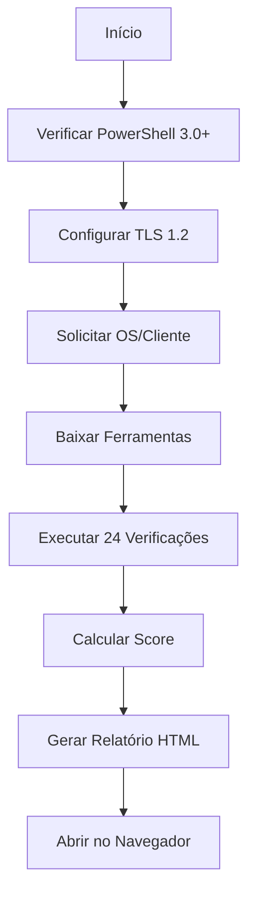

# 📊 CHECK - Diagnóstico Completo do Sistema

## Visão Geral

O **check.ps1** é um script de diagnóstico abrangente que realiza 24 verificações técnicas detalhadas do sistema Windows, gerando um relatório HTML profissional com score de performance e recomendações técnicas.

## Execução Rápida

```powershell
irm https://get.hpinfo.com.br/check | iex
```

---

## Arquitetura Técnica

### Fluxo de Execução



### Componentes Principais

1. **Bloco de Compatibilidade**: Garante PowerShell 3.0+ e TLS 1.2
2. **Sistema de Download**: Baixa ferramentas externas (CoreTemp, CrystalDiskInfo)
3. **Motor de Verificação**: 24 checagens independentes
4. **Gerador de Relatório**: HTML com CSS inline e JavaScript
5. **Sistema de Score**: Cálculo de 0-100 baseado em status

---

## Verificações Implementadas

### 1. Temperatura CPU

**Método**: CoreTemp.exe + WMI Fallback

```powershell
# Executa CoreTemp por 12 segundos
Start-Process CoreTemp.exe -NoNewWindow -PassThru
Start-Sleep -Seconds 12

# Lê log CSV gerado
$log = Get-ChildItem -Filter "CT-Log*.csv" | Select -Last 1
$temp = Parse-CSV-Temperature $log
```

**Critérios**:
- ✅ OK: < 70°C
- ⚠️ ALERTA: 70-85°C
- ❌ CRÍTICO: > 85°C

**Fallback WMI**:
```powershell
$wmi = Get-CimInstance -Namespace root/wmi -ClassName MsAcpi_ThermalZoneTemperature
$celsius = ($wmi.CurrentTemperature / 10) - 273.15
```

---

### 2. Saúde Física do Disco (SMART)

**Método**: CrystalDiskInfo + WMI

```powershell
# Executa CrystalDiskInfo em modo silencioso
Start-Process DiskInfo64.exe -ArgumentList "/CopyExit" -Wait

# Lê arquivo de texto gerado
$txt = Get-Content "DiskInfo.txt" -Raw
if ($txt -match "Health Status : (.*)") {
    $status = $matches[1].Trim()
}
```

**Critérios**:
- ✅ OK: "Good" ou "Saudável"
- ❌ CRÍTICO: Qualquer outro status

---

### 3. Espaço em Disco

**Método**: WMI Win32_LogicalDisk

```powershell
$disks = Get-CimInstance Win32_LogicalDisk -Filter "DriveType=3"
foreach ($d in $disks) {
    $pct = ($d.FreeSpace / $d.Size) * 100
}
```

**Critérios**:
- ✅ OK: > 25%
- ⚠️ ALERTA: 15-25%
- ❌ CRÍTICO: < 15%

---

### 4. Licenciamento Windows

**Método**: Múltiplas verificações em cascata

#### Método 1: Detecção de Ativadores Ilegais
```powershell
$suspectPaths = @("C:\Program Files", "C:\Windows", "$env:APPDATA")
$suspectFiles = @("*KMS*", "*AutoPico*", "*KMSAuto*", "*Microsoft Toolkit*")

foreach ($path in $suspectPaths) {
    $files = Get-ChildItem -Path $path -Filter $pattern -Recurse -Depth 1
}
```

#### Método 2: Registro do Windows
```powershell
$regPath = "HKLM:\SOFTWARE\Microsoft\Windows NT\CurrentVersion\SoftwareProtectionPlatform"
$kmsServer = Get-ItemProperty -Path $regPath -Name "KeyManagementServiceName"
```

#### Método 3: WMI Licensing
```powershell
$license = Get-CimInstance -ClassName SoftwareLicensingProduct | 
    Where-Object { $_.Name -like "*Windows*" -and $_.LicenseStatus -eq 1 }
```

#### Método 4: SLMGR (Fallback)
```powershell
$output = cmd /c "cscript //nologo %windir%\system32\slmgr.vbs /dli"
```

**Critérios**:
- ❌ CRÍTICO: Pirataria detectada
- ⚠️ ALERTA: KMS ou não ativado
- ✅ OK: Licença válida (Retail/OEM/Volume)

---

### 5. Pacote Office

**Método**: OSPP.vbs + WMI

```powershell
# Detecta instalação
$officeReg = Get-ItemProperty HKLM:\Software\Microsoft\Windows\CurrentVersion\Uninstall\* | 
    Where-Object { $_.DisplayName -match "Microsoft (Office|365|Word)" }

# Verifica ativação via ospp.vbs
$osppOutput = cscript //nologo "C:\Program Files\Microsoft Office\Office16\ospp.vbs" /dstatus

if ($osppOutput -match "LICENSE STATUS:\s*---LICENSED---") {
    $status = "Ativo"
}
```

---

### 6. Bloatware / Programas Indesejados

**Método**: Registro de programas instalados

```powershell
$junk = "*WebCompanion*", "*McAfee*", "*Norton*", "*Baidu*", "*Segurazo*", "*Avast*"
$apps = Get-ItemProperty HKLM:\Software\Microsoft\Windows\CurrentVersion\Uninstall\*
$found = $apps | Where { $n = $_.DisplayName; $junk | Where { $n -like $_ } }
```

---

### 7. Memória RAM

**Método**: WMI Win32_OperatingSystem

```powershell
$os = Get-CimInstance Win32_OperatingSystem
$usedPct = (($os.TotalVisibleMemorySize - $os.FreePhysicalMemory) / $os.TotalVisibleMemorySize) * 100
```

**Critérios**:
- ✅ OK: < 85%
- ⚠️ ALERTA: > 85%

---

### 8-16. Outras Verificações

| # | Verificação | Método | Critério |
|---|-------------|--------|----------|
| 8 | Versão Windows | Registro (CurrentBuild) | Build < 19045 = ALERTA |
| 9 | Drivers GPU | WMI VideoController | > 365 dias = ALERTA |
| 10 | Inicialização | Win32_StartupCommand | > 8 itens = ALERTA |
| 11 | Temperatura GPU | WMI ThermalZone | > 85°C = CRÍTICO |
| 12 | Bateria | Win32_Battery | < 70% = ALERTA |
| 13 | Windows Update | COM Microsoft.Update.Session | Pendentes = ALERTA |
| 14 | Integridade Sistema | DISM /CheckHealth | Corrupção = CRÍTICO |
| 15 | Eventos Críticos | Event Viewer (48h) | BSOD = CRÍTICO |
| 16 | Antivírus/Defender | Get-MpComputerStatus | Desativado = CRÍTICO |

---

## Sistema de Score

### Cálculo

```powershell
$totalChecks = $Resultados.Count
$okCount = ($Resultados | Where-Object { $_.Status -eq "OK" }).Count
$score = [math]::Round(($okCount / $totalChecks) * 100, 0)
```

### Classificação

- **90-100**: Excelente 🟢
- **70-89**: Bom 🟡
- **50-69**: Regular 🟠
- **0-49**: Crítico 🔴

---

## Geração de Relatório HTML

### Estrutura

```html
<!DOCTYPE html>
<html>
<head>
    <style>
        /* CSS Inline com cores do Itaú */
        .header { background: linear-gradient(135deg, #EC7000, #FF8C00); }
        .ok { color: #28a745; }
        .alerta { color: #ffc107; }
        .critico { color: #dc3545; }
    </style>
</head>
<body>
    <div class="header">
        <h1>Relatório Técnico HPinfo</h1>
        <p>OS: {OSNumber} | PC: {ComputerName}</p>
    </div>
    
    <div class="score">
        <h2>Score: {Score}/100</h2>
    </div>
    
    <table>
        <!-- Resultados das verificações -->
    </table>
    
    <button onclick="window.print()">Imprimir</button>
    <a href="{WhatsAppLink}">Enviar via WhatsApp</a>
</body>
</html>
```

---

## Ferramentas Externas

### CoreTemp

- **Versão**: Portável
- **Formato**: 7z protegido por senha
- **Extração**: `7z.exe x CoreTemp.7z -p0`
- **Execução**: 12 segundos para coleta de dados
- **Log**: CSV com temperatura de cada core

### CrystalDiskInfo

- **Versão**: Portável
- **Formato**: 7z protegido por senha
- **Execução**: `/CopyExit` (modo silencioso)
- **Saída**: `DiskInfo.txt` com status SMART

---

## Compatibilidade

### Requisitos Mínimos

- Windows 10 1507+ (Build 10240+)
- PowerShell 3.0+
- Privilégios de Administrador

### Fallbacks Implementados

1. **TLS 1.2**: Fallback para string literal em PS antigo
2. **Temperatura**: WMI se CoreTemp falhar
3. **Disco**: WMI Status se CrystalDiskInfo falhar
4. **Licenciamento**: 4 métodos em cascata
5. **Office**: OSPP.vbs → WMI

---

## Logs e Debugging

### Variáveis de Ambiente

```powershell
$ErrorActionPreference = "SilentlyContinue"  # Continua em erros
```

### Arquivos Temporários

- `$env:TEMP\HP-Tools\`: Ferramentas baixadas
- `$env:TEMP\Checkup_HPinfo_Final.html`: Relatório gerado
- `$env:USERPROFILE\Desktop\Relatorio_HPinfo_{PC}.pdf`: Relatório final

---

## Exemplos de Uso

### Execução Padrão

```powershell
# Download e execução
irm https://get.hpinfo.com.br/check | iex

# Será solicitado: Digite o número da OS ou nome do cliente
# Exemplo: OS-12345 ou "João Silva"
```

### Integração com Menu

```powershell
# Via menu principal
irm https://get.hpinfo.com.br/menu | iex
# Selecionar opção 1 (CHECK)
```

---

## Troubleshooting

### Erro: "Não foi possível forçar TLS 1.2"

**Causa**: Windows 10 1507/1511 sem atualizações

**Solução**:
```powershell
# Atualizar Windows ou habilitar TLS 1.2 via registro
Set-ItemProperty -Path 'HKLM:\SOFTWARE\Microsoft\.NetFramework\v4.0.30319' -Name 'SchUseStrongCrypto' -Value 1
```

### Erro: "CoreTemp não retorna temperatura"

**Causa**: Sensor não suportado ou driver ausente

**Solução**: Script usa fallback WMI automaticamente

### Erro: "CrystalDiskInfo falha"

**Causa**: Disco sem suporte SMART (SSD antigo, USB)

**Solução**: Script usa WMI Win32_DiskDrive como fallback

---

## Código-Fonte

[Ver código completo no GitHub](https://github.com/sejalivre/hp-scripts/blob/main/check.ps1)
