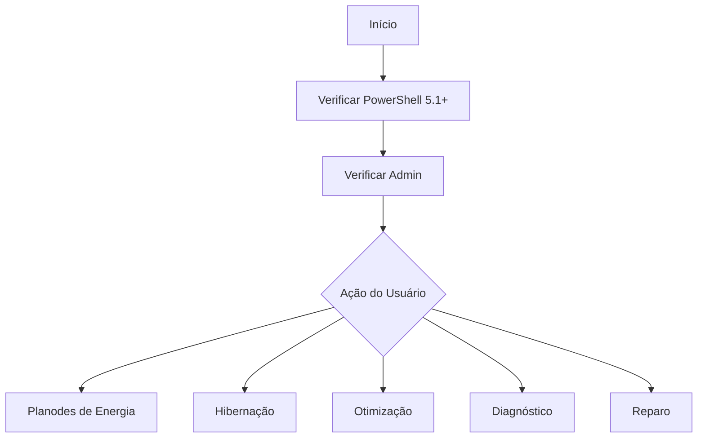

# ⚡ ENERGIA - Gerenciamento de Energia e Energia

## Visão Geral

O **energia.ps1** é um script completo para gerenciamento de energia do Windows, incluindo planos de energia, hibernação, diagnósticos e otimização para diferentes tipos de computador (desktop/notebook).

## Execução Rápida

```powershell
irm https://get.hpinfo.com.br/scripts/energia | iex
```

---

## Arquitetura

### Fluxo de Execução



---

## Funcionalidades

### 1. Planos de Energia

#### Listar Planos Disponíveis

```powershell
powercfg /list
```

**Planos Padrão do Windows**:

| GUID | Nome | Descrição |
|------|------|-----------|
| `8c5e7fda-e8bf-4a96-9a85-a6e23a8c635c` | Alto Desempenho | Máximo desempenho, maior consumo |
| `381b4222-f694-41f0-9685-ff5bb260df2e` | Equilibrado | Equilíbrio entre performance e economia |
| `a1841308-3541-4fab-bc81-f71556f20b4a` | Economia de Energia | Menor consumo, menor desempenho |

#### Ativar Plano de Alto Desempenho

```powershell
powercfg /setactive 8c5e7fda-e8bf-4a96-9a85-a6e23a8c635c
```

**Benefícios**:
- Processador trabalha em frequência máxima
- Melhor desempenho em jogos e aplicações pesadas
- Desliga recursos de economia de energia

**Desvantagens**:
- Maior consumo de energia
- Maior geração de calor
- Bateria drena mais rápido em notebooks

#### Ativar Plano Equilibrado

```powershell
powercfg /setactive 381b4222-f694-41f0-9685-ff5bb260df2e
```

**Benefícios**:
- Bom equilíbrio performance/consumo
- Recomendado para uso geral
- Gerenciamento térmico inteligente

---

### 2. Gerenciamento de Hibernação

#### O que é Hibernação?

A **hibernação** é um estado de economia de energia que:
1. Salva o conteúdo da memória RAM no disco (`hiberfil.sys`)
2. Desliga completamente o computador
3. Ao ligar, restaura o estado anterior

#### Ativar Hibernação

```powershell
powercfg /hibernate on
```

**Uso**:
```powershell
shutdown /h  # Hibernar imediatamente
```

#### Desativar Hibernação

```powershell
powercfg /hibernate off
```

**Vantagem**: Libera espaço em disco (equivalente à RAM instalada)

**Exemplo**: Com 16GB de RAM, `hiberfil.sys` ocupa ~16GB

#### Remover Arquivo de Hibernação

```powershell
# 1. Desativar hibernação
powercfg /hibernate off

# 2. Remover arquivo
Remove-Item C:\hiberfil.sys -Force
```

---

### 3. Otimização para Desktop

```powershell
powercfg /setactive 8c5e7fda-e8bf-4a96-9a85-a6e23a8c635c  # Alto desempenho
powercfg /change disk-timeout-ac 0                          # Disco nunca desliga
powercfg /change monitor-timeout-ac 0                       # Monitor nunca desliga
powercfg /change standby-timeout-ac 0                       # Suspensão desativada
```

**Configurações Aplicadas**:
- ✅ Plano: Alto Desempenho
- ❌ Hibernação: Desativada
- ⏱️ Disco: Nunca desliga
- ⏱️ Monitor: Nunca desliga
- ⏱️ Suspensão: Desativada

---

### 4. Otimização para Notebook

```powershell
powercfg /setactive 381b4222-f694-41f0-9685-ff5bb260df2e  # Equilibrado
powercfg /hibernate on                                     # Hibernação ativada
powercfg /change disk-timeout-ac 20                        # Disco: 20 min
powercfg /change monitor-timeout-ac 15                     # Monitor: 15 min
powercfg /change standby-timeout-ac 30                      # Suspensão: 30 min
```

**Configurações Aplicadas**:
- ✅ Plano: Equilibrado
- ✅ Hibernação: Ativada
- ⏱️ Disco: 20 minutos
- ⏱️ Monitor: 15 minutos
- ⏱️ Suspensão: 30 minutos
- ✅ Hiberboot: Ativado (inicialização rápida)

---

### 5. Diagnóstico Completo

#### Verificar Plano Atual

```powershell
powercfg /getactivescheme
```

#### Ver Configurações de Energia

```powershell
# Tempo do monitor (em segundos)
powercfg /query scheme_current sub_video videoidle

# Tempo do disco
powercfg /query scheme_current sub_disk diskTimeout

# Tempo de suspensão
powercfg /query scheme_current sub_sleep standbyTimeout
```

#### Ver Status da Bateria (Notebooks)

```powershell
Get-CimInstance Win32_Battery | Select-Object BatteryStatus, EstimatedChargeRemaining, EstimatedRunTime
```

#### Ver Tamanho do hiberfil.sys

```powershell
# PowerShell
(Get-Item C:\hiberfil.sys).Length / 1GB

# CMD
dir C:\hiberfil.sys
```

---

### 6. Reparo de Configurações

```powershell
# Restaurar esquemas padrão
powercfg /restoredefaultschemes

# Forçar atualização
powercfg /energy

# Reiniciar serviços relacionados
Restart-Service Power -Force
Restart-Service W32Time -Force
Restart-Service EventLog -Force
```

---

### 7. Criar Plano Personalizado

```powershell
# Criar baseado no plano equilibrado
$balancedGUID = "381b4222-f694-41f0-9685-ff5bb260df2e"
$newPlanGUID = [guid]::NewGuid().ToString()

powercfg /duplicatescheme $balancedGUID $newPlanGUID
powercfg /changename $newPlanGUID "Meu Plano Personalizado" "Descrição"

# Ativar
powercfg /setactive $newPlanGUID
```

---

## Comandos Úteis

### Verificar Status de Energia

```powershell
powercfg /a  # Listar todos os esquemas disponíveis
powercfg /q  # Consultar configurações atuais
powercfg /?  # Ajuda
```

### Mudar Timeout do Monitor

```powershell
# Em AC (tomada): minutos
powercfg /change monitor-timeout-ac 30

# Em DC (bateria): minutos
powercfg /change monitor-timeout-dc 15
```

### Mudar Timeout de Suspensão

```powershell
powercfg /change standby-timeout-ac 0    # Desativado
powercfg /change standby-timeout-dc 30    # 30 minutos
```

### Mudar Timeout do Disco

```powershell
powercfg /change disk-timeout-ac 0    # Nunca desliga
powercfg /change disk-timeout-dc 20    # 20 minutos
```

---

## Configurações do Registro

### Chave Principal

```
HKLM\SYSTEM\CurrentControlSet\Control\Power
```

### Valores Importantes

| Valor | Tipo | Descrição |
|-------|------|-----------|
| `HiberbootEnabled` | DWORD | Inicialização rápida (0=desativado, 1=ativado) |
| `CsEnabled` | DWORD | Connected Standby (Win 8+) |
| `AcSleepTimeout` | DWORD | Timeout suspensão (segundos) |
| `DcSleepTimeout` | DWORD | Timeout suspensão bateria |

---

## Casos de Uso

### 1. Computador Lento

```powershell
# Otimizar para desktop (máximo desempenho)
# No menu do script, selecionar opção 9
```

### 2. Bateria Acabando Rápido

```powershell
# Otimizar para notebook (economia)
# No menu do script, selecionar opção 10
```

### 3. Notebook Não Hiberna

```powershell
# Verificar se hibernação está ativada
powercfg /hibernate query

# Ativar
powercfg /hibernate on
```

### 4. Computador Não Sai do Sleep

```powershell
# Reparar configurações de energia
# No menu do script, selecionar opção 12
```

### 5.Liberar Espaço em Disco

```powershell
# Remover arquivo de hibernação
# No menu do script, selecionar opção 7
```

---

## Troubleshooting

### Erro: "Acesso Negado"

**Causa**: Não é Administrator

**Solução**: Execute o PowerShell como Administrador

### Erro: "PowerCfg: O dispositivo não está pronto"

**Causa**: driver de energia corrompido

**Solução**:
```powershell
# Atualizar drivers de chipset e energia
devmgmt.msc
```

### Hibernação Não Aparece no Menu Iniciar

**Solução**:
```powershell
# Reativar
powercfg /hibernate on

# Verificar no registro
reg add "HKLM\SOFTWARE\Microsoft\Windows\CurrentVersion\Explorer\FlyoutMenuSettings" /v ShowHibernateOption /t REG_DWORD /d 1 /f
```

### Sleep Não Funciona

**Verificar**:
```powershell
# Ver eventos
Get-WinEvent -FilterHashtable @{LogName="System";ID=42} -MaxEvents 10

# Verificar drivers
powercfg /devicequery wake_from_S1_supported
```

---

## Compatibilidade

### Requisitos Mínimos

- Windows 10/11
- PowerShell 5.1+
- Privilégios de Administrador

### Serviços Envolvidos

| Serviço | Descrição |
|---------|-----------|
| `Power` | Gerenciamento de energia |
| `W32Time` | Sincronização de tempo |
| `EventLog` | Registro de eventos |

---

## Código-Fonte

[Ver código completo no GitHub](https://github.com/sejalivre/hp-scripts/blob/main/scripts/energia.ps1)
