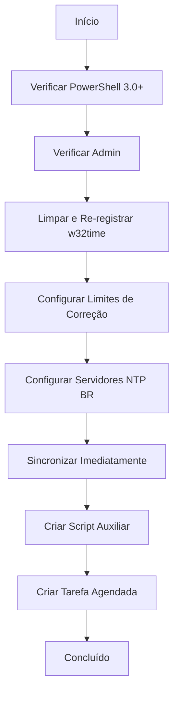

# ⏰ HORA - Sincronização de Horário NTP

## Visão Geral

O **hora.ps1** configura sincronização automática de horário com servidores NTP brasileiros e cria uma tarefa agendada para manutenção contínua da precisão do relógio do sistema.

## Execução Rápida

```powershell
irm https://get.hpinfo.com.br/hora | iex
```

---

## Arquitetura

### Fluxo de Execução



---

## Configuração Inicial

### 1. Limpeza e Re-registro do Serviço

```powershell
# Garante inicialização limpa
Set-Service -Name w32time -StartupType Automatic
net stop w32time 2>$null
w32tm /unregister 2>$null
w32tm /register
net start w32time
```

**Motivo**: Remove configurações corrompidas e reinicia o serviço

---

### 2. Remoção de Limites de Correção

```powershell
$regPath = "HKLM:\SYSTEM\CurrentControlSet\Services\W32Time\Config"
Set-ItemProperty -Path $regPath -Name "MaxPosPhaseCorrection" -Value 4294967295
Set-ItemProperty -Path $regPath -Name "MaxNegPhaseCorrection" -Value 4294967295
```

**Valores Padrão do Windows**:
- `MaxPosPhaseCorrection`: 54000 (15 horas)
- `MaxNegPhaseCorrection`: 54000 (15 horas)

**Novo Valor**: `4294967295` (0xFFFFFFFF) = Sem limite

**Efeito**: Permite correção mesmo se o relógio estiver atrasado/adiantado dias ou meses

---

### 3. Configuração de Servidores NTP

```powershell
w32tm /config /manualpeerlist:"a.st1.ntp.br b.st1.ntp.br pool.ntp.org" /syncfromflags:manual /reliable:YES /update
```

**Servidores Configurados**:
1. `a.st1.ntp.br` - NTP.br Stratum 1 (primário)
2. `b.st1.ntp.br` - NTP.br Stratum 1 (backup)
3. `pool.ntp.org` - Pool global (fallback)

**Parâmetros**:
- `/manualpeerlist`: Lista de servidores separados por espaço
- `/syncfromflags:manual`: Usa lista manual (não domínio)
- `/reliable:YES`: Marca como fonte confiável
- `/update`: Aplica configuração imediatamente

---

### 4. Sincronização Forçada

```powershell
Start-Sleep -Seconds 2
w32tm /resync /rediscover
```

**Comandos**:
- `/resync`: Força sincronização imediata
- `/rediscover`: Redescobre servidores NTP

---

## Script Auxiliar de Auto-Reparo

### Localização

```
C:\intel\sync-time-hpti.ps1
```

### Conteúdo

```powershell
$logPath = "C:\intel\time_sync_log.txt"
Start-Transcript -Path $logPath -Append

function Log-Message {
    param([string]$Message)
    $TimeStamp = Get-Date -Format "yyyy-MM-dd HH:mm:ss"
    Write-Output "[$TimeStamp] $Message"
}

Log-Message "Iniciando script de sincronização via Tarefa Agendada..."

try {
    # Limpeza e reinício do serviço
    Set-Service -Name w32time -StartupType Automatic
    net stop w32time 2>$null
    w32tm /unregister 2>$null
    Start-Sleep -Seconds 1
    w32tm /register
    net start w32time

    # Re-aplica limites de correção
    $regPath = "HKLM:\SYSTEM\CurrentControlSet\Services\W32Time\Config"
    Set-ItemProperty -Path $regPath -Name "MaxPosPhaseCorrection" -Value 4294967295
    Set-ItemProperty -Path $regPath -Name "MaxNegPhaseCorrection" -Value 4294967295

    # Re-configura servidores NTP
    w32tm /config /manualpeerlist:"a.st1.ntp.br b.st1.ntp.br pool.ntp.org" /syncfromflags:manual /reliable:YES /update

    # Tentativas de sincronização com verificação de internet
    $maxRetries = 10
    for ($i=1; $i -le $maxRetries; $i++) {
        Log-Message "Tentativa $i de $maxRetries..."
        
        # Verifica conectividade
        $hasInternet = $false
        foreach ($testHost in @("8.8.8.8", "1.1.1.1", "208.67.222.222")) {
            if (Test-Connection -ComputerName $testHost -Count 1 -Quiet) {
                $hasInternet = $true
                Log-Message "Conectividade confirmada via $testHost"
                break
            }
        }
        
        if ($hasInternet) {
            $result = w32tm /resync /rediscover 2>&1
            if ($LASTEXITCODE -eq 0) {
                Log-Message "Sucesso: $result"
                break
            }
        } else {
            Log-Message "Aguardando conexão de rede..."
        }
        Start-Sleep -Seconds 15
    }
}
catch {
    Log-Message "Erro crítico: $_"
}

Stop-Transcript
```

---

## Tarefa Agendada

### Configuração

```powershell
$TaskName = "SincronizarHorarioHPTI"

# Ação: Executar PowerShell
$Action = New-ScheduledTaskAction `
    -Execute "C:\Windows\System32\WindowsPowerShell\v1.0\powershell.exe" `
    -Argument "-NoProfile -ExecutionPolicy Bypass -WindowStyle Hidden -File `"C:\intel\sync-time-hpti.ps1`""

# Gatilho 1: Ao iniciar o sistema (1 minuto após boot)
$Trigger1 = New-ScheduledTaskTrigger -AtStartup
$Trigger1.Delay = "PT1M"

# Gatilho 2: Ao fazer logon (30 segundos após logon)
$Trigger2 = New-ScheduledTaskTrigger -AtLogOn
$Trigger2.Delay = "PT30S"

# Principal: SYSTEM (privilégio máximo)
$Principal = New-ScheduledTaskPrincipal -UserId "SYSTEM" -LogonType ServiceAccount -RunLevel Highest

# Configurações de resiliência
$Settings = New-ScheduledTaskSettingsSet `
    -AllowStartIfOnBatteries `
    -DontStopIfGoingOnBatteries `
    -StartWhenAvailable `
    -RunOnlyIfNetworkAvailable

# Registrar tarefa
Register-ScheduledTask -TaskName $TaskName -Action $Action -Trigger $Trigger1, $Trigger2 -Principal $Principal -Settings $Settings -Force
```

### Detalhes dos Gatilhos

| Gatilho | Quando | Delay | Motivo |
|---------|--------|-------|--------|
| **AtStartup** | Ao iniciar Windows | 1 minuto | Aguarda rede estabilizar |
| **AtLogOn** | Ao fazer login | 30 segundos | Sincroniza após login |

### Configurações de Resiliência

- **AllowStartIfOnBatteries**: Executa mesmo em bateria (notebooks)
- **DontStopIfGoingOnBatteries**: Não interrompe se desconectar da tomada
- **StartWhenAvailable**: Executa assim que possível se perdeu horário
- **RunOnlyIfNetworkAvailable**: Aguarda rede antes de executar

---

## Verificação de Conectividade

### Servidores Testados

```powershell
$testHosts = @("8.8.8.8", "1.1.1.1", "208.67.222.222")
```

| IP | Serviço | Motivo |
|----|---------|--------|
| `8.8.8.8` | Google DNS | Alta disponibilidade |
| `1.1.1.1` | Cloudflare DNS | Alternativa rápida |
| `208.67.222.222` | OpenDNS | Fallback adicional |

### Lógica de Retry

```powershell
$maxRetries = 10
for ($i=1; $i -le $maxRetries; $i++) {
    if ($hasInternet) {
        $result = w32tm /resync /rediscover 2>&1
        if ($LASTEXITCODE -eq 0) {
            break  # Sucesso
        }
    }
    Start-Sleep -Seconds 15  # Aguarda 15s entre tentativas
}
```

**Total de Tempo**: Até 2,5 minutos (10 tentativas × 15 segundos)

---

## Logs

### Localização

```
C:\intel\time_sync_log.txt
```

### Formato

```
[2026-01-27 01:45:00] Iniciando script de sincronização via Tarefa Agendada...
[2026-01-27 01:45:01] Executando limpeza e re-registro do w32time...
[2026-01-27 01:45:03] Tentativa 1 de 10...
[2026-01-27 01:45:03] Conectividade confirmada via 8.8.8.8
[2026-01-27 01:45:04] Sucesso: Sending resync command to local computer
[2026-01-27 01:45:04] Sincronização concluída com êxito.
```

---

## Compatibilidade

### Requisitos Mínimos

- Windows 8+ (PowerShell 3.0+)
- Privilégios de Administrador
- Conexão com internet

### Serviço w32time

**Verificação**:
```powershell
Get-Service -Name w32time
```

**Iniciar Manualmente**:
```powershell
Start-Service -Name w32time
```

---

## Casos de Uso

### 1. Configuração Inicial

```powershell
# Executar uma vez
irm https://get.hpinfo.com.br/hora | iex
```

### 2. Verificar Sincronização

```powershell
# Ver status
w32tm /query /status

# Ver configuração
w32tm /query /configuration
```

### 3. Forçar Sincronização Manual

```powershell
w32tm /resync /rediscover
```

---

## Troubleshooting

### Erro: "Serviço w32time não encontrado"

**Causa**: Serviço desabilitado ou removido

**Solução**:
```powershell
# Re-registrar serviço
w32tm /register
net start w32time
```

### Erro: "The computer did not resync because no time data was available"

**Causa**: Sem conexão com internet ou firewall bloqueando porta 123 (NTP)

**Solução**:
```powershell
# Verificar firewall
Test-NetConnection -ComputerName a.st1.ntp.br -Port 123

# Liberar porta NTP (UDP 123)
New-NetFirewallRule -DisplayName "NTP Client" -Direction Outbound -Protocol UDP -RemotePort 123 -Action Allow
```

### Tarefa não executa

**Verificação**:
```powershell
# Ver última execução
Get-ScheduledTask -TaskName "SincronizarHorarioHPTI" | Get-ScheduledTaskInfo

# Ver histórico
Get-WinEvent -LogName "Microsoft-Windows-TaskScheduler/Operational" | Where-Object { $_.Message -like "*SincronizarHorarioHPTI*" }
```

---

## Servidores NTP Brasileiros

### NTP.br (Observatório Nacional)

| Servidor | Stratum | Localização |
|----------|---------|-------------|
| `a.st1.ntp.br` | 1 | Rio de Janeiro |
| `b.st1.ntp.br` | 1 | São Paulo |
| `c.st1.ntp.br` | 1 | Brasília |
| `d.st1.ntp.br` | 1 | Porto Alegre |

**Stratum 1**: Sincronizado diretamente com relógio atômico (precisão de microssegundos)

---

## Código-Fonte

[Ver código completo no GitHub](https://github.com/sejalivre/hp-scripts/blob/main/hora.ps1)
