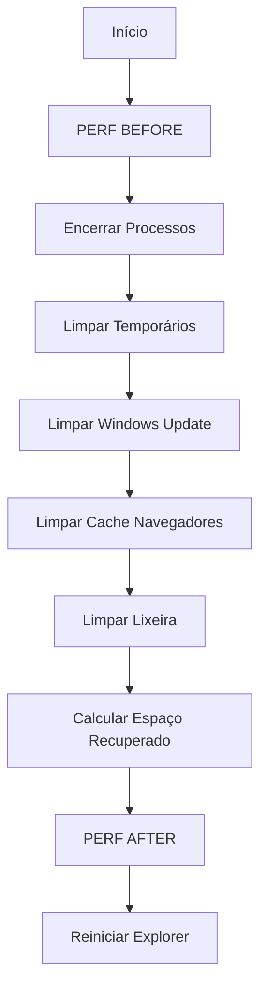

# 🧹 LIMP - Limpeza Profunda do Sistema

## Visão Geral

O **limp.ps1** realiza limpeza agressiva de arquivos temporários, cache de navegadores, Windows Update e otimização de disco, com integração ao sistema PERF para medição de performance antes e depois.

## Execução Rápida

```powershell
irm https://get.hpinfo.com.br/limp | iex
```

---

## Arquitetura

### Fluxo de Execução



### Áreas de Limpeza

| Área | Localização | Descrição |
|------|-------------|-----------|
| **Temp Usuário** | `%TEMP%\*` | Arquivos temporários do usuário |
| **Temp Sistema** | `C:\Windows\Temp\*` | Arquivos temporários do Windows |
| **Prefetch** | `C:\Windows\Prefetch\*` | Cache de pré-carregamento |
| **Thumbnails** | `%LOCALAPPDATA%\Microsoft\Windows\Explorer\thumbcache_*.db` | Miniaturas de imagens |
| **Recentes** | `%APPDATA%\Microsoft\Windows\Recent\*` | Documentos recentes |
| **Logs** | `C:\Windows\Logs\*` | Logs do sistema |
| **Windows Update** | `C:\Windows\SoftwareDistribution\*` | Cache de atualizações |
| **Catroot2** | `C:\Windows\System32\catroot2\*` | Catálogo de assinaturas |
| **Chrome Cache** | `%LOCALAPPDATA%\Google\Chrome\User Data\Default\Cache\*` | Cache do Chrome |
| **Edge Cache** | `%LOCALAPPDATA%\Microsoft\Edge\User Data\Default\Cache\*` | Cache do Edge |
| **Firefox Cache** | `%LOCALAPPDATA%\Mozilla\Firefox\Profiles\*\cache2\*` | Cache do Firefox |
| **Lixeira** | Todas as unidades | Lixeira do Windows |
| **Delivery Optimization** | `C:\Windows\SoftwareDistribution\DeliveryOptimization\*` | Cache P2P de updates |

---

## Integração com PERF

### Medição Antes da Limpeza

```powershell
try {
    if (Test-Connection -ComputerName "get.hpinfo.com.br" -Count 1 -Quiet) {
        $env:HPINFO_PERF_STAGE = "BEFORE"
        irm https://get.hpinfo.com.br/perf | iex
    }
}
catch {
    Write-Host "Aviso: Erro ao executar verificação de performance" -ForegroundColor Yellow
}
```

### Medição Depois da Limpeza

```powershell
try {
    if (Test-Connection -ComputerName "get.hpinfo.com.br" -Count 1 -Quiet) {
        $env:HPINFO_PERF_STAGE = "AFTER"
        irm https://get.hpinfo.com.br/perf | iex
    }
}
catch {
    Write-Host "Aviso: Erro ao executar verificação de performance final" -ForegroundColor Yellow
}
```

**Variável de Ambiente**: `$env:HPINFO_PERF_STAGE` indica ao script PERF se está medindo antes ou depois da limpeza.

---

## Detalhamento Técnico

### 1. Encerramento de Processos

```powershell
$processos = @(
    "winword", "excel", "powerpnt", "outlook",  # Office
    "chrome", "msedge", "firefox", "brave",     # Navegadores
    "acrord32", "explorer"                      # Adobe, Explorer
)

foreach ($p in $processos) {
    Get-Process -Name $p -ErrorAction SilentlyContinue | Stop-Process -Force
}
Start-Sleep -Seconds 2
```

**Motivo**: Libera arquivos bloqueados (cache de navegadores, thumbnails do Explorer)

---

### 2. Limpeza de Temporários e Prefetch

```powershell
$pastasLimpar = @(
    "$env:TEMP\*",
    "C:\Windows\Temp\*",
    "C:\Windows\Prefetch\*",
    "$env:LOCALAPPDATA\Microsoft\Windows\Explorer\thumbcache_*.db",
    "$env:APPDATA\Microsoft\Windows\Recent\*",
    "C:\Windows\Logs\*"
)

foreach ($caminho in $pastasLimpar) {
    if (Test-Path $caminho) {
        Remove-Item $caminho -Recurse -Force
    }
}
```

**Impacto**:
- **Prefetch**: Primeiro boot após limpeza pode ser mais lento (será recriado)
- **Thumbnails**: Miniaturas de imagens serão regeneradas
- **Recentes**: Histórico de documentos recentes será limpo

---

### 3. Limpeza de Windows Update

#### Parar Serviços

```powershell
$servicos = "wuauserv", "bits", "cryptsvc"

foreach ($s in $servicos) {
    Get-Service $s -ErrorAction SilentlyContinue | 
        Where-Object { $_.Status -ne "Stopped" } | 
        Stop-Service -Force
}
```

#### Limpar Cache

```powershell
$updateFolders = "C:\Windows\SoftwareDistribution", "C:\Windows\System32\catroot2"

foreach ($folder in $updateFolders) {
    if (Test-Path $folder) {
        Remove-Item "$folder\*" -Recurse -Force
    }
}
```

#### Reiniciar Serviços

```powershell
foreach ($s in $servicos) {
    Get-Service $s -ErrorAction SilentlyContinue | Start-Service
}
```

**Serviços Envolvidos**:
- **wuauserv**: Windows Update
- **bits**: Background Intelligent Transfer Service
- **cryptsvc**: Cryptographic Services

**Efeito**: Força o Windows Update a revalidar todos os componentes

---

### 4. Limpeza de Cache de Navegadores

```powershell
$browserCaches = @(
    "$env:LOCALAPPDATA\Google\Chrome\User Data\Default\Cache\*",
    "$env:LOCALAPPDATA\Microsoft\Edge\User Data\Default\Cache\*",
    "$env:LOCALAPPDATA\Mozilla\Firefox\Profiles\*\cache2\*"
)

foreach ($path in $browserCaches) {
    if (Test-Path $path) {
        Remove-Item $path -Recurse -Force
    }
}
```

**Nota**: Navegadores devem estar fechados (por isso o encerramento de processos)

---

### 5. Limpeza de Lixeira

#### PowerShell 5.0+

```powershell
if ($PSVersionTable.PSVersion.Major -ge 5) {
    Clear-RecycleBin -Confirm:$false -ErrorAction SilentlyContinue
}
```

#### Fallback PowerShell 3.0-4.0

```powershell
else {
    try {
        $shell = New-Object -ComObject Shell.Application
        $recycleBin = $shell.NameSpace(10)
        $recycleBin.Items() | ForEach-Object { 
            Remove-Item $_.Path -Recurse -Force -ErrorAction SilentlyContinue 
        }
    }
    catch {
        Write-Host "Aviso: Não foi possível limpar a lixeira" -ForegroundColor Yellow
    }
}
```

**Namespace 10**: Código COM para Lixeira do Windows

---

### 6. Delivery Optimization

```powershell
$doPath = "C:\Windows\SoftwareDistribution\DeliveryOptimization"
if (Test-Path $doPath) {
    Remove-Item "$doPath\*" -Recurse -Force
}
```

**O que é**: Cache P2P de atualizações do Windows (compartilhamento entre PCs na rede)

---

## Cálculo de Espaço Recuperado

```powershell
# Antes da limpeza
$espacoAntes = (Get-PSDrive C).Free

# ... limpeza ...

# Depois da limpeza
$espacoDepois = (Get-PSDrive C).Free
$totalLimpoMB = [math]::Round(($espacoDepois - $espacoAntes) / 1MB, 2)

Write-Host "Espaço recuperado: $totalLimpoMB MB" -ForegroundColor White
```

**Nota**: Valor pode ser negativo se arquivos foram criados durante a execução

---

## Compatibilidade

### Requisitos Mínimos

- Windows 8+ (PowerShell 3.0+)
- Privilégios de Administrador (recomendado)

### Fallbacks Implementados

1. **Lixeira**: COM Object para PS 3.0-4.0
2. **Processos**: `ErrorAction SilentlyContinue` se processo não existir
3. **Serviços**: Verifica existência antes de parar

---

## Casos de Uso

### 1. Limpeza Pré-Manutenção

```powershell
# Executar antes de diagnóstico
irm https://get.hpinfo.com.br/limp | iex
```

### 2. Limpeza com Medição de Performance

```powershell
# O script já faz automaticamente:
# 1. Mede performance ANTES
# 2. Executa limpeza
# 3. Mede performance DEPOIS
# 4. Gera relatório comparativo
```

### 3. Integração com Menu

```powershell
irm https://get.hpinfo.com.br/menu | iex
# Selecionar opção 3 (LIMP)
```

---

## Impacto e Efeitos Colaterais

### Positivos

✅ Libera espaço em disco  
✅ Remove arquivos corrompidos do Windows Update  
✅ Acelera navegadores (cache limpo)  
✅ Remove logs antigos  

### Temporários

⚠️ Primeiro boot pode ser mais lento (Prefetch)  
⚠️ Miniaturas de imagens serão regeneradas  
⚠️ Histórico de documentos recentes será perdido  
⚠️ Windows Update precisará revalidar componentes  

### Permanentes

❌ Histórico de navegação não é afetado (apenas cache)  
❌ Senhas salvas não são afetadas  
❌ Favoritos/Bookmarks não são afetados  

---

## Troubleshooting

### Erro: "Acesso negado" em alguns arquivos

**Causa**: Arquivos em uso ou sem permissão

**Solução**: Script usa `-Force` e `-ErrorAction SilentlyContinue` para continuar

### Espaço recuperado é negativo

**Causa**: Arquivos criados durante execução (logs, temp)

**Solução**: Normal, executar novamente ou ignorar

### Explorer não reinicia

**Causa**: Processo travado

**Solução**:
```powershell
# Manual
taskkill /f /im explorer.exe
start explorer.exe
```

---

## Segurança

### Arquivos Não Afetados

- Documentos pessoais
- Downloads
- Área de trabalho
- Configurações de programas
- Senhas salvas
- Favoritos de navegadores

### Reversibilidade

⚠️ **ATENÇÃO**: Limpeza é **irreversível**. Arquivos são deletados permanentemente (não vão para lixeira).

---

## Performance Esperada

### Espaço Típico Recuperado

- **Uso leve**: 500MB - 2GB
- **Uso moderado**: 2GB - 5GB
- **Uso pesado**: 5GB - 20GB+
- **Sem limpeza há meses**: 20GB - 50GB+

### Tempo de Execução

- **SSD**: 30-60 segundos
- **HDD**: 1-3 minutos
- **HDD lento/cheio**: 3-10 minutos

---

## Código-Fonte

[Ver código completo no GitHub](https://github.com/sejalivre/hp-scripts/blob/main/limp.ps1)
