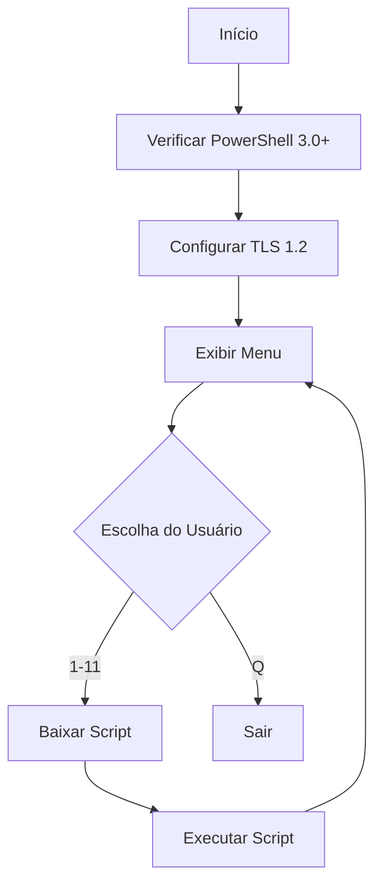

# 🚀 MENU - Hub de Automação Principal

## Visão Geral

O **menu.ps1** é o launcher principal que fornece acesso interativo a todas as ferramentas do HP-Scripts através de um menu numerado, com download e execução dinâmica de scripts.

## Execução Rápida

```powershell
irm https://get.hpinfo.com.br/menu | iex
```

---

## Arquitetura

### Fluxo de Execução



---

## Estrutura de Dados

### Array de Ferramentas

```powershell
$ferramentas = @(
    @{ ID = "CHECK"   ; Desc = "Verificações Rápidas e Integridade" ; Path = "check" ; Color = "Yellow" }
    @{ ID = "INSTALLPS1" ; Desc = "Instalar/Atualizar PowerShell"   ; Path = "installps1.cmd" ; Color = "Cyan" ; IsCmd = $true }
    @{ ID = "LIMP"    ; Desc = "Limpeza de Arquivos Temporários"     ; Path = "limp"  ; Color = "Yellow" }
    @{ ID = "UPDATE"  ; Desc = "Atualizações do Sistema"             ; Path = "update"; Color = "Yellow" }
    @{ ID = "HORA"    ; Desc = "Sincronizando Horário"               ; Path = "hora"  ; Color = "Yellow" }
    @{ ID = "REDE"    ; Desc = "Reparo de Rede e Conectividade"      ; Path = "net"   ; Color = "Yellow" }
    @{ ID = "PRINT"   ; Desc = "Módulo de Impressão"                 ; Path = "print" ; Color = "Yellow" }
    @{ ID = "BACKUP"  ; Desc = "Rotina de Backup de Usuário"         ; Path = "backup"; Color = "Yellow" }
    @{ ID = "ATIV"    ; Desc = "Ativação (get.activated.win)"        ; Path = "https://get.activated.win" ; External = $true }
    @{ ID = "WALL"    ; Desc = "Configurar Wallpaper Padrão"         ; Path = "wallpaper" ; Color = "Magenta" }
    @{ ID = "NEXTDNS" ; Desc = "Gerenciamento NextDNS"               ; Path = "tools/nextdns/nextdns" ; Color = "Yellow" }
)
```

**Propriedades**:
- `ID`: Identificador único
- `Desc`: Descrição exibida no menu
- `Path`: Caminho relativo ou URL completa
- `Color`: Cor de destaque (opcional)
- `IsCmd`: `true` se for arquivo `.cmd` (batch)
- `External`: `true` se for URL externa

---

## Renderização do Menu

```powershell
function Show-MainMenu {
    Clear-Host
    Write-Host "==========================================================" -ForegroundColor Cyan
    Write-Host "             HPCRAFT - HUB DE AUTOMAÇÃO TI                " -ForegroundColor White -BackgroundColor DarkBlue
    Write-Host "      Suporte: docs.hpinfo.com.br | v1.4                  " -ForegroundColor Gray
    Write-Host "==========================================================" -ForegroundColor Cyan
    
    for ($i = 0; $i -lt $ferramentas.Count; $i++) {
        $n = $i + 1
        $item = $ferramentas[$i]
        Write-Host ("{0,2}. [{1,-7}] {2}" -f $n, $item.ID, $item.Desc)
    }
    
    Write-Host "----------------------------------------------------------"
    Write-Host "Q. Sair"
    Write-Host "==========================================================" -ForegroundColor Cyan
}
```

**Saída**:
```
==========================================================
             HPCRAFT - HUB DE AUTOMAÇÃO TI                
      Suporte: docs.hpinfo.com.br | v1.4                  
==========================================================
 1. [CHECK  ] Verificações Rápidas e Integridade
 2. [INSTALLPS1] Instalar/Atualizar PowerShell
 3. [LIMP   ] Limpeza de Arquivos Temporários
 4. [UPDATE ] Atualizações do Sistema
 5. [HORA   ] Sincronizando Horário
 6. [REDE   ] Reparo de Rede e Conectividade
 7. [PRINT  ] Módulo de Impressão
 8. [BACKUP ] Rotina de Backup de Usuário
 9. [ATIV   ] Ativação (get.activated.win)
10. [WALL   ] Configurar Wallpaper Padrão
11. [NEXTDNS] Gerenciamento NextDNS
----------------------------------------------------------
Q. Sair
==========================================================
```

---

## Lógica de Execução

### Scripts PowerShell (.ps1)

```powershell
# Montagem da URL
$finalUrl = "https://get.hpinfo.com.br/$($selecionada.Path)"

# Download para arquivo temporário
$TempScript = "$env:TEMP\HPTI_Exec_$($selecionada.ID).ps1"
Invoke-WebRequest -Uri $finalUrl -OutFile $TempScript -UseBasicParsing

# Execução
if (Test-Path $TempScript) {
    & $TempScript
    Remove-Item $TempScript -Force -ErrorAction SilentlyContinue
}
```

---

### Scripts Batch (.cmd)

```powershell
if ($selecionada.IsCmd) {
    $finalUrl = "https://get.hpinfo.com.br/$($selecionada.Path)"
    $TempCmd = "$env:TEMP\HPTI_Exec_$($selecionada.ID).cmd"
    
    Invoke-WebRequest -Uri $finalUrl -OutFile $TempCmd -UseBasicParsing
    
    if (Test-Path $TempCmd) {
        Start-Process -FilePath "cmd.exe" -ArgumentList "/c `"$TempCmd`"" -Wait -NoNewWindow
        Remove-Item $TempCmd -Force -ErrorAction SilentlyContinue
    }
}
```

---

### URLs Externas

```powershell
if ($selecionada.External) {
    $finalUrl = $selecionada.Path  # URL completa
    # Download e execução normal
}
```

---

## Compatibilidade

### Bloco de Compatibilidade

```powershell
# Verificação de Versão do PowerShell
if ($PSVersionTable.PSVersion.Major -lt 3) {
    Write-Host "[ERRO] Este script requer PowerShell 3.0 ou superior." -ForegroundColor Red
    exit 1
}

# Configuração de TLS 1.2
try {
    [System.Net.ServicePointManager]::SecurityProtocol = [System.Net.SecurityProtocolType]::Tls12
}
catch {
    try {
        [System.Net.ServicePointManager]::SecurityProtocol = 'Tls12'
    }
    catch {
        Write-Warning "Não foi possível forçar TLS 1.2. Conexões HTTPS podem falhar."
    }
}
```

---

### Compatibilidade de ReadKey

```powershell
# Compatibilidade: ReadKey() não funciona em ISE ou sessões remotas
if ($Host.Name -eq 'ConsoleHost' -and $Host.UI.RawUI) {
    try {
        $null = $Host.UI.RawUI.ReadKey("NoEcho,IncludeKeyDown")
    }
    catch {
        Read-Host "Pressione ENTER para continuar"
    }
}
else {
    Read-Host "Pressione ENTER para continuar"
}
```

---

## Tratamento de Erros

```powershell
try {
    Invoke-WebRequest -Uri $finalUrl -OutFile $TempScript -UseBasicParsing
    
    if (Test-Path $TempScript) {
        & $TempScript
        Remove-Item $TempScript -Force -ErrorAction SilentlyContinue
    }
    else {
        throw "Arquivo não foi baixado corretamente."
    }
}
catch {
    Write-Host "`n[❌] ERRO: Falha na execução remota." -ForegroundColor Red
    Write-Host "URL: $finalUrl" -ForegroundColor Gray
    Write-Host "Detalhe: $($_.Exception.Message)" -ForegroundColor DarkGray
}
```

---

## Casos de Uso

### 1. Acesso Interativo a Todas as Ferramentas

```powershell
irm https://get.hpinfo.com.br/menu | iex
# Selecionar opção desejada
```

### 2. Manutenção Completa do Sistema

```powershell
irm https://get.hpinfo.com.br/menu | iex
# 1. CHECK (diagnóstico)
# 3. LIMP (limpeza)
# 4. UPDATE (atualizações)
# 6. REDE (se necessário)
```

---

## Vantagens da Arquitetura

### Download Dinâmico

✅ **Sempre Atualizado**: Scripts são baixados do repositório em tempo real  
✅ **Sem Instalação**: Não precisa clonar repositório  
✅ **Leve**: Apenas o menu é carregado inicialmente  

### Execução Temporária

✅ **Limpo**: Scripts são deletados após execução  
✅ **Seguro**: Não deixa rastros no sistema  
✅ **Isolado**: Cada execução é independente  

---

## Troubleshooting

### Erro: "Falha na execução remota"

**Causa**: Sem conexão com internet ou servidor inacessível

**Solução**:
```powershell
# Verificar conectividade
Test-NetConnection -ComputerName get.hpinfo.com.br -Port 443
```

### Menu não exibe corretamente

**Causa**: Terminal muito pequeno ou codificação incorreta

**Solução**: Maximizar janela do PowerShell

---

## Código-Fonte

[Ver código completo no GitHub](https://github.com/sejalivre/hp-scripts/blob/main/menu.ps1)
