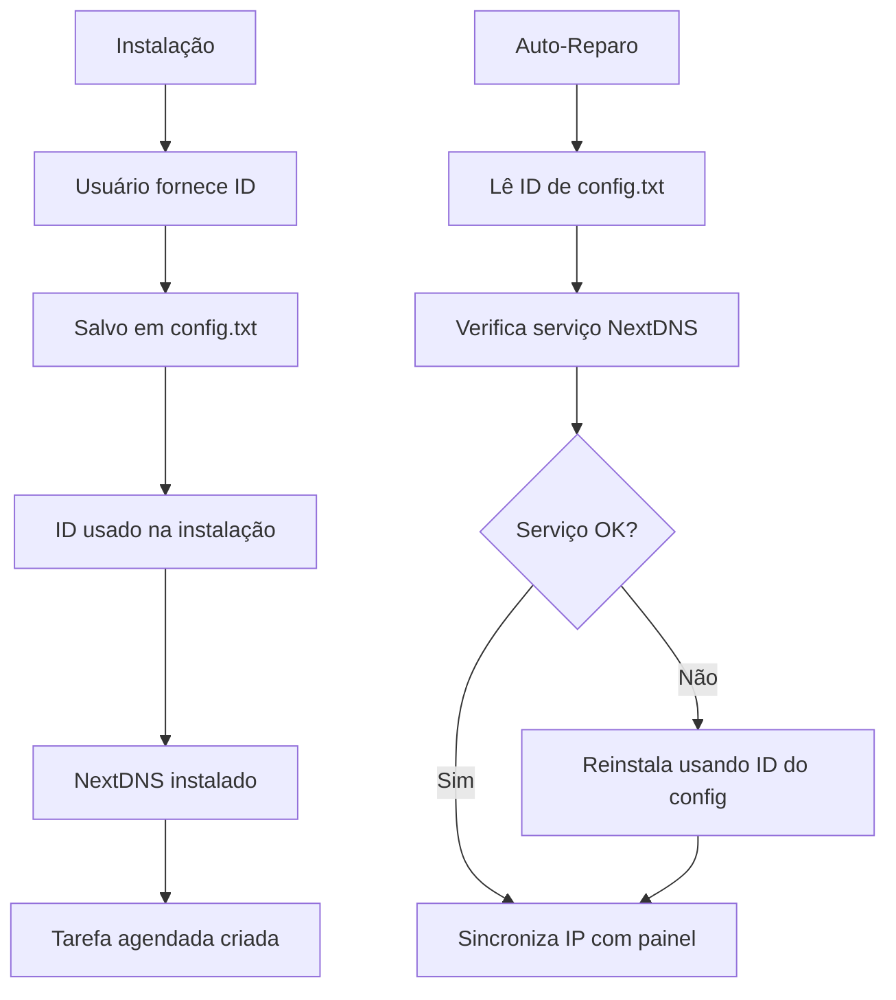

# 🛡️ NextDNS - Bloqueio e Filtragem de Conteúdo

## Visão Geral

O módulo NextDNS fornece instalação e gerenciamento completo do NextDNS com configuração personalizada por técnico/cliente, incluindo sistema de auto-recuperação e persistência de configuração.

## Execução Rápida

```powershell
# Menu completo de gerenciamento
irm https://get.hpinfo.com.br/tools/nextdns/nextdns | iex

# Instalação direta
irm https://get.hpinfo.com.br/tools/nextdns/install | iex
```

---

## Características Principais

✅ **Configuração por ID**: Cada instalação usa um ID NextDNS específico  
✅ **Auto-Recuperação**: Tarefa agendada verifica e repara automaticamente a cada hora  
✅ **Persistência**: ID salvo em arquivo de configuração para reinstalações  
✅ **Bloqueio HTTPS**: Certificado instalado para bloquear sites em HTTPS  
✅ **Modo Stealth**: Oculto do Painel de Controle para evitar remoção acidental  
✅ **DDNS Integrado**: Vincula IP automaticamente ao painel NextDNS  

---

## Scripts Disponíveis

### 1. install.ps1 - Instalação Completa

**Características**:
- Solicita ID do NextDNS durante instalação
- Valida formato do ID (6 caracteres alfanuméricos)
- Salva ID em `C:\Program Files\HPTI\config.txt`
- Instala certificado de bloqueio
- Oculta do Painel de Controle
- Configura tarefa agendada de auto-reparo
- Vincula IP ao painel NextDNS (DDNS)

**Uso**:
```powershell
irm get.hpinfo.com.br/tools/nextdns/install | iex
```

**Durante a instalação**:
1. Script solicitará seu ID NextDNS
2. Encontre seu ID em: https://my.nextdns.io
3. Digite o ID (exemplo: `abc123`)
4. ID será salvo automaticamente

---

### 2. reparar_nextdns.ps1 - Manutenção Automática

**O que faz**:
- Lê ID do arquivo de configuração (sem prompts)
- Verifica se o serviço NextDNS está rodando
- Reinstala se o serviço foi removido
- Restaura DNS para DHCP
- Reaplica certificado de bloqueio
- Oculta do Painel de Controle
- Sincroniza IP com NextDNS

**Execução**:
- **Automática**: Roda a cada 60 minutos via tarefa agendada
- **Manual**: `irm get.hpinfo.com.br/tools/nextdns/reparar_nextdns | iex`

⚠️ **Importante**: Roda em modo oculto quando executado pela tarefa agendada (não solicita entrada do usuário)

---

### 3. nextdns.ps1 - Menu de Gerenciamento

**Opções**:
1. Instalar NextDNS
2. Ver/Alterar ID Configurado
3. Restaurar DNS Padrão
4. Reparar Instalação
5. Remover Configurações HPTI

**Uso**:
```powershell
irm get.hpinfo.com.br/tools/nextdns/nextdns | iex
```

---

### 4. dns_padrão.ps1 - Restaurar DNS

Restaura todas as interfaces de rede para DHCP (DNS automático).

**Uso**:
```powershell
irm get.hpinfo.com.br/tools/nextdns/dns_padrão | iex
```

---

### 5. remover_hpti.ps1 - Desinstalação Completa

**O que remove**:
- Tarefa agendada de reparo
- Serviço NextDNS
- Arquivos de script em `C:\Program Files\HPTI`
- Arquivo de configuração
- Pasta do NextDNS

**Após remoção**:
- Define DNS para Google (8.8.8.8 e 8.8.4.4)
- Limpa cache DNS

**Uso**:
```powershell
irm get.hpinfo.com.br/tools/nextdns/remover_hpti | iex
```

---

## Configuração do ID NextDNS

### Como Obter seu ID

1. Acesse https://my.nextdns.io
2. Faça login na sua conta
3. O ID aparece na URL: `https://my.nextdns.io/abc123/setup`
4. Seu ID é `abc123` (sempre 6 caracteres alfanuméricos)

### Onde o ID é Armazenado

```
C:\Program Files\HPTI\config.txt
```

### Como Alterar o ID

**Opção 1: Via Menu**
```powershell
irm get.hpinfo.com.br/tools/nextdns/nextdns | iex
# Escolha opção 2: Ver/Alterar ID Configurado
```

**Opção 2: Manual**
```powershell
# Edite o arquivo diretamente
notepad "C:\Program Files\HPTI\config.txt"
# Salve apenas o ID (6 caracteres) na primeira linha

# Reinstale para aplicar
irm get.hpinfo.com.br/tools/nextdns/install | iex
```

---

## Arquitetura Técnica

### Estrutura de Arquivos

```
C:\Program Files\HPTI\
├── config.txt                 # ID do NextDNS
├── reparar_nextdns.ps1        # Script de auto-reparo
└── logs\                      # (futuro) Logs de operação

C:\Program Files\NextDNS\
└── NextDNSSetup.exe           # Executável do NextDNS

Tarefa Agendada:
└── HPTI_NextDNS_Reparo        # Roda a cada 60 minutos
```

### Fluxo de Dados



---

## Verificação de Funcionamento

### 1. Verificar Serviço

```powershell
Get-Service -Name "NextDNS"
# Status deve ser "Running"
```

### 2. Verificar DNS

```powershell
nslookup facebook.com
# Se bloqueado, deve resolver para IP do NextDNS
```

### 3. Verificar no Painel

1. Acesse https://my.nextdns.io
2. Vá em "Logs"
3. Você deve ver requisições do seu computador
4. O nome do computador deve aparecer corretamente

---

## Solução de Problemas

### Problema: NextDNS não está bloqueando

**Possíveis causas e soluções**:

#### 1. ID incorreto configurado
```powershell
# Verifique o ID atual
Get-Content "C:\Program Files\HPTI\config.txt"

# Se estiver errado, use o menu para alterar
irm get.hpinfo.com.br/tools/nextdns/nextdns | iex
```

#### 2. Serviço parado
```powershell
# Execute o reparo
irm get.hpinfo.com.br/tools/nextdns/reparar_nextdns | iex
```

#### 3. DNS estático configurado manualmente
```powershell
# Restaure para DHCP
irm get.hpinfo.com.br/tools/nextdns/dns_padrão | iex
```

---

### Problema: Arquivo de configuração não encontrado

```powershell
# Reinstale para criar o arquivo
irm get.hpinfo.com.br/tools/nextdns/install | iex
```

---

### Problema: Computador não aparece no painel NextDNS

```powershell
# Execute o reparo para vincular IP
irm get.hpinfo.com.br/tools/nextdns/reparar_nextdns | iex
```

---

### Problema: Bloqueio para de funcionar após reiniciar

**Causa**: Tarefa agendada não está configurada

**Solução**:
```powershell
# Verifique a tarefa
Get-ScheduledTask -TaskName "HPTI_NextDNS_Reparo"

# Se não existir, reinstale
irm get.hpinfo.com.br/tools/nextdns/install | iex
```

---

## Fluxo de Trabalho Recomendado

### Instalação Inicial

1. Execute o instalador
2. Digite seu ID NextDNS quando solicitado
3. Aguarde conclusão
4. Teste o bloqueio visitando um site bloqueado

### Manutenção

- Script de reparo roda automaticamente a cada hora
- Não é necessária intervenção manual
- Se houver problemas, execute o reparo manualmente

### Mudança de Cliente

1. Acesse o menu NextDNS
2. Escolha "Ver/Alterar ID Configurado"
3. Digite o novo ID
4. Opte por reinstalar quando perguntado

### Remoção

1. Execute o script de remoção
2. Confirme a operação
3. DNS será restaurado para Google (8.8.8.8)

---

## Requisitos

- Windows 7 ou superior
- PowerShell 5.1 ou superior (7+ recomendado)
- Direitos de administrador
- Conexão com internet
- Conta NextDNS ativa

---

## Segurança

- ID do NextDNS é armazenado em texto simples em `config.txt`
- Apenas administradores podem modificar arquivos em `Program Files`
- Certificado de bloqueio é instalado no armazenamento confiável do sistema
- Tarefa agendada roda como SYSTEM para máxima confiabilidade

---

## Notas de Versão

### Versão 2.0 (Atual)
- ✅ Sistema de configuração baseado em arquivo
- ✅ Validação de ID durante instalação
- ✅ Menu com visualização de ID atual
- ✅ Opção para alterar ID sem reinstalar
- ✅ Melhor tratamento de erros
- ✅ Feedback visual aprimorado
- ✅ Compatibilidade com PowerShell 5.1+

### Versão 1.2 (Anterior)
- ❌ Prompt de ID no script de reparo (não funcionava em modo oculto)
- ❌ ID hardcoded no instalador
- ⚠️ Bloqueio parava de funcionar após implementação do prompt

---

## Documentação Completa

[Ver README completo no GitHub](https://github.com/sejalivre/hp-scripts/blob/main/tools/nextdns/README.md)
