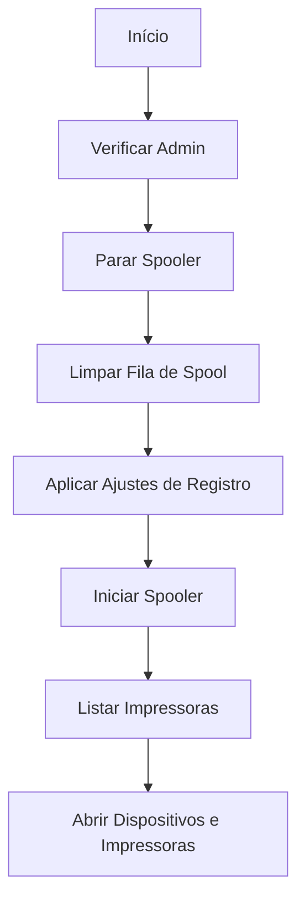

# 🖨️ PRINT - Reparo do Sistema de Impressão

## Visão Geral

O **print.ps1** reinicia o serviço Spooler, limpa filas travadas e aplica ajustes de registro para resolver problemas de impressão e compatibilidade com impressoras de rede.

## Execução Rápida

```powershell
irm https://get.hpinfo.com.br/print | iex
```

---

## Fluxo de Execução



---

## Operações Principais

### 1. Parar Serviço Spooler

```powershell
Stop-Service -Name Spooler -Force -ErrorAction Stop
```

**Spooler**: Serviço responsável por gerenciar fila de impressão

---

### 2. Limpar Pasta de Spool

```powershell
Remove-Item -Path "$env:WINDIR\System32\spool\PRINTERS\*" -Force -Recurse
```

**Localização**: `C:\Windows\System32\spool\PRINTERS\`

**Conteúdo**: Arquivos `.SHD` (Shadow) e `.SPL` (Spool) de trabalhos de impressão

**Efeito**: Remove trabalhos travados na fila

---

### 3. Ajustes de Registro

#### Feature Management Overrides

```powershell
$regChanges = @(
    @{ Path = "HKLM:\SYSTEM\CurrentControlSet\Policies\Microsoft\FeatureManagement\Overrides"
       Name = "713073804"; Value = 0; Type = "DWord" }
    @{ Path = "HKLM:\SYSTEM\CurrentControlSet\Policies\Microsoft\FeatureManagement\Overrides"
       Name = "1921033356"; Value = 0; Type = "DWord" }
    @{ Path = "HKLM:\SYSTEM\CurrentControlSet\Policies\Microsoft\FeatureManagement\Overrides"
       Name = "3598754956"; Value = 0; Type = "DWord" }
)
```

**Efeito**: Desativa proteções do PrintNightmare (CVE-2021-34527)

---

#### Point and Print

```powershell
@{ Path = "HKLM:\SOFTWARE\Policies\Microsoft\Windows NT\Printers\PointAndPrint"
   Name = "RestrictDriverInstallationToAdministrators"; Value = 0; Type = "DWord" }
@{ Path = "HKLM:\SOFTWARE\Policies\Microsoft\Windows NT\Printers\PointAndPrint"
   Name = "UpdatePromptSettings"; Value = 0; Type = "DWord" }
@{ Path = "HKLM:\SOFTWARE\Policies\Microsoft\Windows NT\Printers\PointAndPrint"
   Name = "NoWarningNoElevationOnInstall"; Value = 0; Type = "DWord" }
```

**Efeito**: Permite instalação de drivers de impressora sem elevação

---

#### RPC Authentication

```powershell
@{ Path = "HKLM:\SYSTEM\CurrentControlSet\Control\Print"
   Name = "RpcAuthnLevelPrivacyEnabled"; Value = 0; Type = "DWord" }
```

**Efeito**: Desativa autenticação RPC (compatibilidade com impressoras antigas)

---

### 4. Reiniciar Spooler

```powershell
Start-Service -Name Spooler -ErrorAction Stop
Start-Sleep -Seconds 5

$status = Get-Service -Name Spooler
if ($status.Status -eq 'Running') {
    Write-Output "[OK] Spooler reiniciado com sucesso!"
}
```

---

### 5. Listar Impressoras

#### PowerShell 3.0+

```powershell
if ($PSVersionTable.PSVersion.Major -ge 3) {
    Get-Printer | Format-Table Name, DriverName, PortName -AutoSize
}
```

#### Fallback PowerShell 2.0

```powershell
else {
    Get-WmiObject Win32_Printer | Format-Table Name, DriverName, PortName -AutoSize
}
```

---

### 6. Abrir Dispositivos e Impressoras

```powershell
Start-Process "explorer.exe" "shell:::{A8A91A66-3A7D-4424-8D24-04E180695C7A}"
```

**CLSID**: `{A8A91A66-3A7D-4424-8D24-04E180695C7A}` = Dispositivos e Impressoras (vista clássica)

---

## Detalhes dos Ajustes de Registro

### PrintNightmare Mitigations

**CVE-2021-34527**: Vulnerabilidade de execução remota de código via Print Spooler

**IDs de Feature**:
- `713073804`: Proteção contra instalação não autorizada
- `1921033356`: Verificação de assinatura de driver
- `3598754956`: Restrição de privilégios

**Valor 0**: Desativa proteção (necessário para impressoras antigas)

⚠️ **AVISO DE SEGURANÇA**: Desativar essas proteções pode expor o sistema a vulnerabilidades. Use apenas em ambientes confiáveis.

---

### Point and Print

**O que é**: Tecnologia que permite instalar impressoras de rede automaticamente

**Configurações**:
- `RestrictDriverInstallationToAdministrators = 0`: Permite usuários comuns instalarem drivers
- `UpdatePromptSettings = 0`: Não solicita confirmação para atualizar drivers
- `NoWarningNoElevationOnInstall = 0`: Não exige elevação para instalar

---

### RPC Authentication Level

**RpcAuthnLevelPrivacyEnabled = 0**: Desativa criptografia RPC

**Motivo**: Impressoras antigas não suportam RPC com criptografia (Windows 11 22H2+)

---

## Compatibilidade

### Requisitos Mínimos

- Windows 7+
- PowerShell 2.0+
- Privilégios de Administrador

### Fallbacks Implementados

1. **Listagem de Impressoras**: WMI para PS 2.0
2. **Criação de Chaves de Registro**: Cria se não existir

---

## Casos de Uso

### 1. Fila de Impressão Travada

```powershell
irm https://get.hpinfo.com.br/print | iex
```

**Sintomas**:
- Documentos não imprimem
- Status "Imprimindo" mas nada sai
- Erro "Spooler parou"

---

### 2. Erro ao Instalar Impressora de Rede

```powershell
irm https://get.hpinfo.com.br/print | iex
```

**Sintomas**:
- "Você precisa de permissões de administrador"
- "Driver não pôde ser instalado"
- "Operação falhou com erro 0x00000709"

---

### 3. Impressora Não Aparece no Windows 11

```powershell
irm https://get.hpinfo.com.br/print | iex
```

**Sintomas**:
- Impressora funciona em Windows 10 mas não em Windows 11
- Erro "RPC server unavailable"

---

## Troubleshooting

### Erro: "Spooler não inicia"

**Causa**: Dependências não satisfeitas ou driver corrompido

**Solução**:
```powershell
# Verificar dependências
Get-Service -Name Spooler | Select-Object -ExpandProperty DependentServices

# Verificar log de eventos
Get-WinEvent -LogName System | Where-Object { $_.ProviderName -eq "Service Control Manager" -and $_.Message -like "*Spooler*" }

# Remover drivers corrompidos
Remove-PrinterDriver -Name "Nome do Driver"
```

---

### Erro: "Acesso negado ao instalar impressora"

**Causa**: Proteções do PrintNightmare ainda ativas

**Solução**:
```powershell
# Verificar registro
Get-ItemProperty -Path "HKLM:\SOFTWARE\Policies\Microsoft\Windows NT\Printers\PointAndPrint"

# Executar script novamente
irm https://get.hpinfo.com.br/print | iex
```

---

### Impressora instalada mas não imprime

**Verificações**:
```powershell
# Ver status da impressora
Get-Printer -Name "Nome da Impressora"

# Testar porta
Test-NetConnection -ComputerName "IP_DA_IMPRESSORA" -Port 9100

# Ver fila
Get-PrintJob -PrinterName "Nome da Impressora"

# Limpar fila
Get-PrintJob -PrinterName "Nome da Impressora" | Remove-PrintJob
```

---

## Segurança

### Riscos dos Ajustes

⚠️ **CRÍTICO**: Os ajustes de registro desativam proteções de segurança

**Vulnerabilidades Expostas**:
- **CVE-2021-34527** (PrintNightmare): Execução remota de código
- **CVE-2021-1675**: Elevação de privilégios

**Recomendações**:
1. Use apenas em ambientes confiáveis
2. Mantenha Windows atualizado
3. Use firewall para bloquear porta 445 (SMB) externamente
4. Considere desabilitar Spooler se não usar impressoras

---

### Desabilitar Spooler (Segurança Máxima)

```powershell
# Se não usa impressoras
Stop-Service -Name Spooler
Set-Service -Name Spooler -StartupType Disabled
```

---

## Comandos Úteis

### Gerenciar Impressoras

```powershell
# Listar impressoras
Get-Printer

# Adicionar impressora de rede
Add-Printer -ConnectionName "\\SERVIDOR\Impressora"

# Remover impressora
Remove-Printer -Name "Nome da Impressora"

# Definir impressora padrão
Set-Printer -Name "Nome da Impressora" -Default
```

### Gerenciar Drivers

```powershell
# Listar drivers
Get-PrinterDriver

# Remover driver
Remove-PrinterDriver -Name "Nome do Driver"

# Adicionar driver
Add-PrinterDriver -Name "Nome do Driver"
```

### Gerenciar Portas

```powershell
# Listar portas
Get-PrinterPort

# Adicionar porta TCP/IP
Add-PrinterPort -Name "IP_192.168.1.100" -PrinterHostAddress "192.168.1.100"
```

---

## Código-Fonte

[Ver código completo no GitHub](https://github.com/sejalivre/hp-scripts/blob/main/print.ps1)
