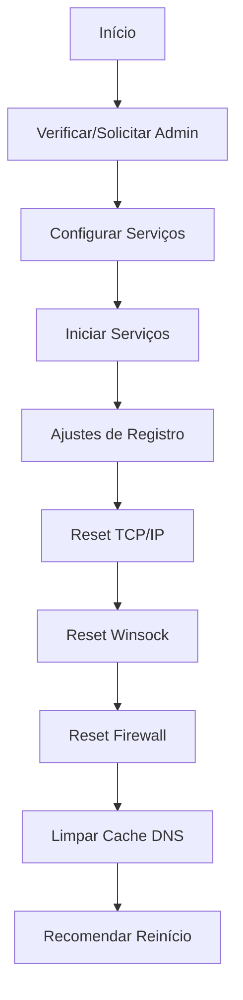

# 🌐 REDE - Reset Completo de Rede

## Visão Geral

O **net.ps1** realiza reset completo da pilha TCP/IP, limpeza de cache DNS, reinício de serviços de rede e ajustes de registro para resolver problemas de conectividade.

## Execução Rápida

```powershell
irm https://get.hpinfo.com.br/net | iex
```

---

## Arquitetura

### Fluxo de Execução



---

## Serviços Configurados

### Lista de Serviços

```powershell
$servicesToEnable = @(
    "browser",           # Computer Browser
    "Dhcp",             # DHCP Client
    "lanmanserver",     # Server (compartilhamento)
    "lanmanworkstation", # Workstation (acesso a compartilhamentos)
    "Netman",           # Network Connections
    "Schedule",         # Task Scheduler
    "Netlogon",         # Netlogon (domínio)
    "NtLmSsp",          # NTLM Security Support Provider
    "Dnscache",         # DNS Client
    "Nla",              # Network Location Awareness
    "netsvcs"           # Network Services
)
```

### Configuração Automática

```powershell
foreach ($svc in $servicesToEnable) {
    if (Get-Service -Name $svc -ErrorAction SilentlyContinue) {
        Set-Service -Name $svc -StartupType Automatic
        Write-Output "→ $svc → Automatic"
    }
}
```

### Inicialização

```powershell
foreach ($svc in $servicesToEnable) {
    if (Get-Service -Name $svc -ErrorAction SilentlyContinue) {
        Start-Service -Name $svc -ErrorAction SilentlyContinue
        Write-Output "→ Iniciado: $svc"
    }
}
```

---

## Ajustes de Registro

### 1. FormatDatabase (Offline Files)

```powershell
Set-ItemProperty -Path "HKLM:\SYSTEM\CurrentControlSet\Services\Csc\Parameters" `
    -Name "FormatDatabase" -Value 1 -Type DWord -Force
```

**Efeito**: Força recriação do banco de dados de arquivos offline (resolve corrupção)

---

### 2. LimitBlankPasswordUse

```powershell
Set-ItemProperty -Path "HKLM:\SYSTEM\CurrentControlSet\Control\Lsa" `
    -Name "LimitBlankPasswordUse" -Value 0 -Type DWord -Force
```

**Efeito**: Permite acesso a compartilhamentos sem senha (rede doméstica)

**Valores**:
- `0`: Permite acesso sem senha
- `1`: Bloqueia acesso sem senha (padrão seguro)

---

### 3. LocalAccountTokenFilterPolicy

```powershell
Set-ItemProperty -Path "HKLM:\SOFTWARE\Microsoft\Windows\CurrentVersion\Policies\System" `
    -Name "LocalAccountTokenFilterPolicy" -Value 1 -Type DWord -Force
```

**Efeito**: Permite administração remota com contas locais (UAC)

**Valores**:
- `0`: Filtra tokens de admin local (padrão)
- `1`: Não filtra (permite admin remoto)

---

## Reset de Rede

### 1. Reset TCP/IP

```powershell
netsh int ip reset | Out-Null
```

**O que faz**:
- Reseta pilha TCP/IP para padrões de fábrica
- Remove configurações de IP estático
- Reseta rotas estáticas
- Limpa tabela ARP

**Arquivo de Log**: `C:\Windows\System32\LogFiles\reset.log`

---

### 2. Reset Winsock

```powershell
netsh winsock reset | Out-Null
```

**O que faz**:
- Reseta catálogo Winsock (LSP - Layered Service Provider)
- Remove LSPs maliciosos instalados por malware
- Resolve erros de socket

**Requer Reinício**: Sim

---

### 3. Reset Firewall

```powershell
netsh advfirewall reset | Out-Null
```

**O que faz**:
- Restaura regras de firewall para padrões
- Remove regras personalizadas
- Reseta perfis (Domínio, Privado, Público)

---

## Limpeza de Cache DNS

### PowerShell 3.0+

```powershell
if ($PSVersionTable.PSVersion.Major -ge 3) {
    Clear-DnsClientCache -ErrorAction Stop
    Write-Output "→ Cache DNS limpo com sucesso"
}
```

### Fallback PowerShell 2.0

```powershell
else {
    $result = ipconfig /flushdns
    if ($LASTEXITCODE -eq 0) {
        Write-Output "→ Cache DNS limpo com sucesso"
    }
    else {
        Write-Warning "Falha ao limpar cache DNS"
    }
}
```

**Efeito**: Remove entradas DNS em cache (resolve problemas de resolução de nomes)

---

## Elevação Automática de Privilégios

```powershell
$isAdmin = ([Security.Principal.WindowsPrincipal] [Security.Principal.WindowsIdentity]::GetCurrent()).IsInRole([Security.Principal.WindowsBuiltInRole]::Administrator)

if (-not $isAdmin) {
    Write-Warning "Solicitando privilégios de administrador..."
    $arguments = "& '$PSCommandPath'"
    Start-Process powershell -Verb runAs -ArgumentList $arguments
    exit
}
```

**Comportamento**:
1. Verifica se está rodando como admin
2. Se não, abre nova janela com privilégios elevados
3. Fecha janela atual

---

## Compatibilidade

### Requisitos Mínimos

- Windows 10+
- PowerShell 5.1+
- Privilégios de Administrador

### Fallbacks Implementados

1. **Cache DNS**: `ipconfig /flushdns` para PS 2.0
2. **Serviços**: Verifica existência antes de configurar
3. **Registro**: `ErrorAction SilentlyContinue` para chaves inexistentes

---

## Casos de Uso

### 1. Sem Acesso à Internet

```powershell
irm https://get.hpinfo.com.br/net | iex
# Reiniciar o computador
```

### 2. Erro "DNS_PROBE_FINISHED_NO_INTERNET"

```powershell
irm https://get.hpinfo.com.br/net | iex
```

### 3. Não Consegue Acessar Compartilhamentos de Rede

```powershell
irm https://get.hpinfo.com.br/net | iex
# Reiniciar o computador
```

### 4. Erro "Limited Connectivity" ou "No Internet Access"

```powershell
irm https://get.hpinfo.com.br/net | iex
```

---

## Impacto e Efeitos

### Positivos

✅ Resolve 90% dos problemas de rede  
✅ Remove configurações corrompidas  
✅ Limpa LSPs maliciosos  
✅ Reseta firewall para padrões seguros  

### Temporários

⚠️ Perde configurações de IP estático  
⚠️ Perde rotas estáticas personalizadas  
⚠️ Perde regras de firewall personalizadas  

### Requer Ação

🔄 **REINÍCIO OBRIGATÓRIO** para aplicar todas as mudanças

---

## Troubleshooting

### Erro: "Acesso negado"

**Causa**: Não está rodando como administrador

**Solução**: Script solicita elevação automaticamente

### Serviços não iniciam

**Causa**: Dependências não satisfeitas

**Solução**:
```powershell
# Verificar dependências
Get-Service -Name Dhcp | Select-Object -ExpandProperty DependentServices

# Iniciar manualmente
Start-Service -Name Dhcp
```

### Ainda sem internet após reset

**Causas Possíveis**:
1. Problema no modem/roteador
2. Cabo de rede desconectado
3. Adaptador de rede desabilitado
4. Driver de rede corrompido

**Verificações**:
```powershell
# Ver adaptadores
Get-NetAdapter

# Habilitar adaptador
Enable-NetAdapter -Name "Ethernet"

# Renovar IP
ipconfig /release
ipconfig /renew
```

---

## Comandos Úteis Pós-Reset

### Verificar Configuração de Rede

```powershell
# Ver configuração IP
ipconfig /all

# Ver adaptadores
Get-NetAdapter

# Ver rotas
route print

# Testar conectividade
Test-Connection -ComputerName 8.8.8.8 -Count 4
```

### Verificar DNS

```powershell
# Ver cache DNS
Get-DnsClientCache

# Testar resolução
Resolve-DnsName google.com

# Ver servidores DNS configurados
Get-DnsClientServerAddress
```

---

## Quando NÃO Usar

❌ **Não use se**:
- Tem configurações de IP estático importantes
- Tem regras de firewall personalizadas críticas
- Tem rotas estáticas configuradas
- Está em ambiente corporativo gerenciado (GPO)

**Alternativa**: Anotar configurações antes de executar

---

## Código-Fonte

[Ver código completo no GitHub](https://github.com/sejalivre/hp-scripts/blob/main/net.ps1)
