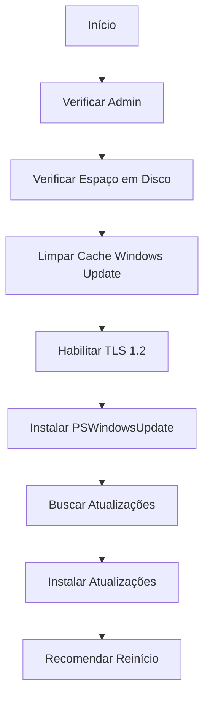

# 🔄 UPDATE - Gerenciador de Atualizações do Windows

## Visão Geral

O **update.ps1** repara o Windows Update, instala o módulo PSWindowsUpdate e executa busca e instalação automática de atualizações pendentes.

## Execução Rápida

```powershell
irm https://get.hpinfo.com.br/update | iex
```

---

## Fluxo de Execução



---

## Operações Principais

### 1. Limpeza de Cache do Windows Update

```powershell
function Clear-WindowsUpdateCache {
    # Parar serviços
    $servicos = @("wuauserv", "bits", "cryptsvc")
    foreach ($s in $servicos) { 
        Stop-Service $s -Force -ErrorAction SilentlyContinue 
    }
    
    # Renomear pastas (backup)
    $folders = @("C:\Windows\SoftwareDistribution", "C:\Windows\System32\catroot2")
    foreach ($folder in $folders) {
        if (Test-Path $folder) {
            $backup = "${folder}.old"
            if (Test-Path $backup) { Remove-Item $backup -Recurse -Force }
            Rename-Item -Path $folder -NewName $backup -Force
        }
    }
    
    # Reiniciar serviços
    foreach ($s in $servicos) { 
        Start-Service $s -ErrorAction SilentlyContinue 
    }
}
```

**Efeito**: Força o Windows Update a recriar cache e revalidar componentes

---

### 2. Habilitação de TLS 1.2

```powershell
try {
    $protocols = [Net.ServicePointManager]::SecurityProtocol
    if ($protocols -notmatch 'Tls12') {
        [Net.ServicePointManager]::SecurityProtocol = [Net.SecurityProtocolType]::Tls12
        Write-Log "TLS 1.2 habilitado"
    }
}
catch {
    Write-Log "AVISO: Não foi possível habilitar TLS 1.2"
}
```

**Motivo**: PowerShell Gallery requer TLS 1.2 para download de módulos

---

### 3. Detecção e Configuração de Proxy

```powershell
$proxySettings = Get-ItemProperty -Path "HKCU:\Software\Microsoft\Windows\CurrentVersion\Internet Settings"
if ($proxySettings -and $proxySettings.ProxyEnable -eq 1) {
    $proxy = $proxySettings.ProxyServer
    [System.Net.WebRequest]::DefaultWebProxy = New-Object System.Net.WebProxy($proxy, $true)
    [System.Net.WebRequest]::DefaultWebProxy.Credentials = [System.Net.CredentialCache]::DefaultNetworkCredentials
}
```

**Efeito**: Permite download de módulos em ambientes corporativos com proxy

---

### 4. Instalação do PSWindowsUpdate

```powershell
function Install-PSWindowsUpdateModule {
    if (!(Get-Module -ListAvailable -Name PSWindowsUpdate)) {
        # Instalar NuGet provider
        Install-PackageProvider -Name NuGet -MinimumVersion 2.8.5.201 -Force
        
        # Instalar módulo
        Install-Module PSWindowsUpdate -Force -Confirm:$false -AllowClobber
        
        return $true
    }
    return $true
}
```

**PSWindowsUpdate**: Módulo da comunidade para gerenciar Windows Update via PowerShell

---

### 5. Busca e Instalação de Atualizações

```powershell
Import-Module PSWindowsUpdate
Get-WindowsUpdate -Install -AcceptAll -IgnoreReboot
```

**Parâmetros**:
- `-Install`: Instala atualizações encontradas
- `-AcceptAll`: Aceita todos os EULAs automaticamente
- `-IgnoreReboot`: Não reinicia automaticamente

---

## Verificação de Espaço em Disco

```powershell
$drive = Get-PSDrive C
$freeGB = [math]::Round($drive.Free / 1GB, 2)

if ($freeGB -lt 10) {
    Write-Host "Espaço livre: $freeGB GB. Continuar? (S/N): " -NoNewline -ForegroundColor Yellow
    $response = Read-Host
    if ($response -ne 'S' -and $response -ne 's') {
        Write-Log "Operação cancelada pelo usuário"
        return
    }
}
```

**Limite Mínimo**: 10 GB recomendados para atualizações

---

## Sistema de Logs

### Localização

```
C:\Windows\Logs\WindowsUpdateScript.log
```

### Função de Log

```powershell
function Write-Log {
    param([string]$Message)
    $timestamp = Get-Date -Format "yyyy-MM-dd HH:mm:ss"
    $logMessage = "[$timestamp] $Message"
    Write-Host $logMessage -ForegroundColor Gray
    $logMessage | Out-File -FilePath $logFile -Append -Force
}
```

### Exemplo de Log

```
[2026-01-27 01:45:00] === INICIO DA ATUALIZACAO ===
[2026-01-27 01:45:01] Espaço livre em C: 45.32 GB
[2026-01-27 01:45:02] Iniciando limpeza do cache do Windows Update...
[2026-01-27 01:45:05] Cache limpo e serviços reiniciados.
[2026-01-27 01:45:06] TLS 1.2 habilitado
[2026-01-27 01:45:07] Módulo PSWindowsUpdate instalado com sucesso
[2026-01-27 01:45:10] Buscando atualizacoes...
[2026-01-27 01:50:30] Atualizações instaladas. Reinicie o computador quando possível.
[2026-01-27 01:50:31] === FIM DO PROCESSO ===
```

---

## Compatibilidade

### Requisitos Mínimos

- Windows 10+
- PowerShell 5.1+
- Privilégios de Administrador
- Conexão com internet
- 10 GB de espaço livre (recomendado)

### Dependências

- **NuGet Provider**: Gerenciador de pacotes
- **PSWindowsUpdate**: Módulo da comunidade
- **PowerShell Gallery**: Repositório de módulos

---

## Casos de Uso

### 1. Windows Update Travado

```powershell
irm https://get.hpinfo.com.br/update | iex
```

**Sintomas**:
- "Verificando atualizações..." infinito
- Erro 0x80070422
- Erro 0x80240034

---

### 2. Instalar Todas as Atualizações Pendentes

```powershell
irm https://get.hpinfo.com.br/update | iex
# Aguardar conclusão
# Reiniciar o computador
```

---

### 3. Reparar Windows Update Corrompido

```powershell
irm https://get.hpinfo.com.br/update | iex
```

---

## Troubleshooting

### Erro: "Não foi possível instalar módulo"

**Causa**: Sem acesso à PowerShell Gallery ou TLS 1.2 não habilitado

**Solução**:
```powershell
# Verificar conectividade
Test-NetConnection -ComputerName www.powershellgallery.com -Port 443

# Habilitar TLS 1.2 via registro (requer reinício)
Set-ItemProperty -Path 'HKLM:\SOFTWARE\Microsoft\.NetFramework\v4.0.30319' -Name 'SchUseStrongCrypto' -Value 1
```

---

### Erro: "Espaço insuficiente"

**Causa**: Menos de 10 GB livres

**Solução**:
```powershell
# Executar limpeza primeiro
irm https://get.hpinfo.com.br/limp | iex

# Depois executar update
irm https://get.hpinfo.com.br/update | iex
```

---

### Erro: "Acesso negado"

**Causa**: Não está rodando como administrador

**Solução**:
```powershell
# Abrir PowerShell como Admin
Start-Process powershell -Verb runAs
```

---

## Comandos Úteis

### Verificar Atualizações Manualmente

```powershell
# Listar atualizações disponíveis
Get-WindowsUpdate

# Listar atualizações instaladas
Get-WindowsUpdate -IsInstalled

# Ocultar atualização específica
Hide-WindowsUpdate -KBArticleID "KB5034441"
```

### Gerenciar Serviços do Windows Update

```powershell
# Ver status dos serviços
Get-Service wuauserv, bits, cryptsvc

# Iniciar serviços
Start-Service wuauserv, bits, cryptsvc

# Parar serviços
Stop-Service wuauserv, bits, cryptsvc
```

---

## Código-Fonte

[Ver código completo no GitHub](https://github.com/sejalivre/hp-scripts/blob/main/update.ps1)
