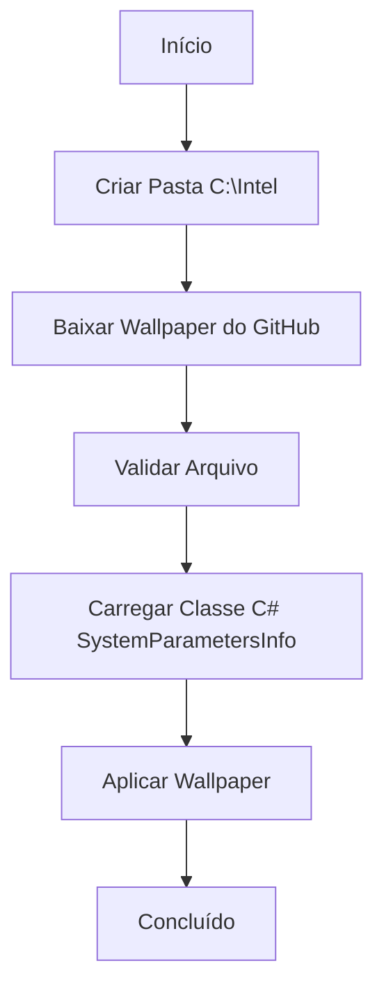

# 🎨 WALLPAPER - Configuração de Papel de Parede Corporativo

## Visão Geral

O **wallpaper.ps1** baixa e aplica automaticamente um papel de parede corporativo padrão usando a API SystemParametersInfo do Windows.

## Execução Rápida

```powershell
irm https://get.hpinfo.com.br/wallpaper | iex
```

---

## Fluxo de Execução



---

## Implementação Técnica

### 1. Download do Wallpaper

```powershell
$wpUrl = "https://raw.githubusercontent.com/sejalivre/hp-scripts/main/tools/wallpaper.jpg"
$wpPath = "C:\Intel\wallpaper.jpg"

# Criar pasta se não existir
$wpDir = Split-Path $wpPath
if (-not (Test-Path $wpDir)) {
    New-Item -Path $wpDir -ItemType Directory -Force | Out-Null
}

# Download com fallback para PS 2.0
if ($PSVersionTable.PSVersion.Major -ge 3) {
    Invoke-WebRequest -Uri $wpUrl -OutFile $wpPath -ErrorAction Stop
}
else {
    $webClient = New-Object System.Net.WebClient
    $webClient.DownloadFile($wpUrl, $wpPath)
}
```

---

### 2. Validação do Arquivo

```powershell
# Verificar se arquivo existe
if (-not (Test-Path $wpPath)) {
    Write-Warning "Arquivo não foi baixado corretamente"
    exit
}

# Verificar tamanho mínimo
$fileSize = (Get-Item $wpPath).Length
if ($fileSize -lt 10KB) {
    Write-Warning "Arquivo muito pequeno ($fileSize bytes). Pode estar corrompido."
    exit
}
```

**Validação**: Garante que o arquivo foi baixado corretamente (não é página de erro HTML)

---

### 3. Classe C# para SystemParametersInfo

```powershell
$code = @'
using System.Runtime.InteropServices;
public class Wallpaper {
    [DllImport("user32.dll", CharSet = CharSet.Auto)]
    public static extern int SystemParametersInfo(int uAction, int uParam, string lpvParam, int fuWinIni);
}
'@

# Injeta o tipo se não existir
try {
    $wallpaperType = [Wallpaper]
}
catch {
    Add-Type -TypeDefinition $code -ErrorAction Stop
}
```

**DllImport**: Importa função nativa do Windows (user32.dll)

---

### 4. Aplicação do Wallpaper

```powershell
[Wallpaper]::SystemParametersInfo(20, 0, $wpPath, 3)
```

**Parâmetros**:
- `20` = `SPI_SETDESKWALLPAPER` (código da ação)
- `0` = não usado
- `$wpPath` = caminho completo do arquivo
- `3` = `SPIF_UPDATEINIFILE | SPIF_SENDCHANGE`
  - `SPIF_UPDATEINIFILE` (0x01): Atualiza arquivo de configuração
  - `SPIF_SENDCHANGE` (0x02): Notifica todos os aplicativos da mudança

---

## API SystemParametersInfo

### Assinatura

```c
BOOL SystemParametersInfoA(
  [in]      UINT  uiAction,
  [in]      UINT  uiParam,
  [in, out] PVOID pvParam,
  [in]      UINT  fWinIni
);
```

### Constantes

```c
#define SPI_SETDESKWALLPAPER  0x0014  // 20 em decimal
#define SPIF_UPDATEINIFILE    0x0001  // 1 em decimal
#define SPIF_SENDCHANGE       0x0002  // 2 em decimal
```

---

## Compatibilidade

### Requisitos Mínimos

- Windows 7+
- PowerShell 2.0+
- Conexão com internet
- Permissão para escrever em `C:\Intel`

### Fallbacks Implementados

1. **Download**: `WebClient` para PowerShell 2.0
2. **Tipo C#**: Verifica se já existe antes de adicionar

---

## Localização do Arquivo

### Caminho Padrão

```
C:\Intel\wallpaper.jpg
```

**Motivo**: Pasta permanente (não é deletada por limpeza de temporários)

### URL do Wallpaper

```
https://raw.githubusercontent.com/sejalivre/hp-scripts/main/tools/wallpaper.jpg
```

---

## Casos de Uso

### 1. Aplicar Wallpaper Corporativo

```powershell
irm https://get.hpinfo.com.br/wallpaper | iex
```

### 2. Padronização Pós-Formatação

```powershell
# Incluir no script de setup
irm https://get.hpinfo.com.br/wallpaper | iex
```

### 3. Integração com Menu

```powershell
irm https://get.hpinfo.com.br/menu | iex
# Selecionar opção 10 (WALL)
```

---

## Troubleshooting

### Erro: "Arquivo não foi baixado corretamente"

**Causa**: Sem conexão com internet ou GitHub inacessível

**Solução**:
```powershell
# Verificar conectividade
Test-NetConnection -ComputerName raw.githubusercontent.com -Port 443

# Baixar manualmente
Invoke-WebRequest -Uri "https://raw.githubusercontent.com/sejalivre/hp-scripts/main/tools/wallpaper.jpg" -OutFile "C:\Intel\wallpaper.jpg"
```

---

### Erro: "Arquivo muito pequeno"

**Causa**: Download retornou página de erro (HTML) em vez de imagem

**Solução**:
```powershell
# Verificar conteúdo do arquivo
Get-Content "C:\Intel\wallpaper.jpg" -TotalCount 5

# Se for HTML, deletar e tentar novamente
Remove-Item "C:\Intel\wallpaper.jpg"
irm https://get.hpinfo.com.br/wallpaper | iex
```

---

### Wallpaper não aplica

**Causa**: Política de grupo bloqueando mudança de wallpaper

**Verificação**:
```powershell
# Verificar política de grupo
Get-ItemProperty -Path "HKCU:\Software\Microsoft\Windows\CurrentVersion\Policies\ActiveDesktop"
Get-ItemProperty -Path "HKCU:\Software\Microsoft\Windows\CurrentVersion\Policies\System"
```

**Solução**: Remover restrições de GPO ou aplicar via administrador

---

## Personalização

### Usar Wallpaper Customizado

```powershell
# Modificar URL no script
$wpUrl = "https://seu-servidor.com/wallpaper.jpg"

# Ou aplicar arquivo local
$wpPath = "C:\Caminho\Para\Seu\Wallpaper.jpg"
[Wallpaper]::SystemParametersInfo(20, 0, $wpPath, 3)
```

---

## Código-Fonte

[Ver código completo no GitHub](https://github.com/sejalivre/hp-scripts/blob/main/wallpaper.ps1)
