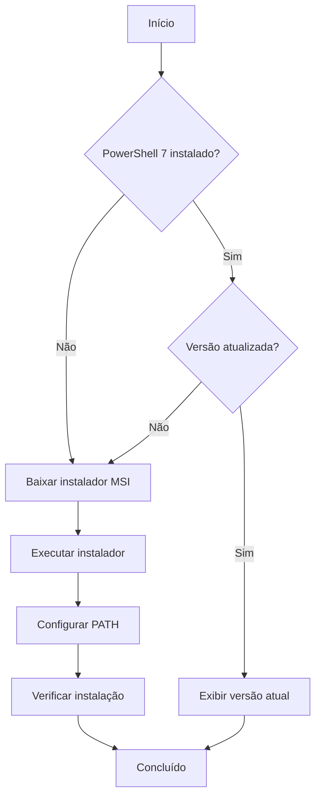

# 🔧 PowerShell 7 - Instalador Automático

Utilitário para verificar, atualizar ou instalar o PowerShell 7 automaticamente.

---

## Visão Geral

O `installps1.cmd` é um script batch que:

✅ Detecta se PowerShell 7 está instalado  
✅ Verifica a versão atual  
✅ Baixa e instala a versão mais recente  
✅ Configura PATH automaticamente  
✅ Funciona em Windows 7 SP1 ou superior  

---

## Execução Rápida

### Instalação Automática

```powershell
irm get.hpinfo.com.br/installps1.cmd | cmd
```

### Execução Local

```cmd
installps1.cmd
```

---

## Como Funciona

### Fluxo de Execução



### Detecção de Instalação

O script verifica:

1. **Registro do Windows** - Chave de instalação do PowerShell 7
2. **PATH do sistema** - Presença do executável `pwsh.exe`
3. **Versão instalada** - Compara com versão mais recente disponível

### Download e Instalação

**Fonte oficial:**
```
https://github.com/PowerShell/PowerShell/releases/latest
```

**Arquitetura detectada automaticamente:**
- x64 (64 bits) - `PowerShell-7.x.x-win-x64.msi`
- x86 (32 bits) - `PowerShell-7.x.x-win-x86.msi`

**Instalação silenciosa:**
```cmd
msiexec /i PowerShell-7.x.x-win-x64.msi /quiet /norestart
```

---

## Requisitos

### Sistema Operacional

| Windows | Suporte |
|---------|---------|
| Windows 7 SP1 | ✅ Suportado |
| Windows 8.1 | ✅ Suportado |
| Windows 10 | ✅ Suportado |
| Windows 11 | ✅ Suportado |
| Windows Server 2012 R2+ | ✅ Suportado |

### Dependências

- **.NET Framework 4.5+** (geralmente já instalado)
- **Windows Management Framework 3.0+**
- **Conexão com internet** (para download)
- **Privilégios de administrador** (para instalação)

---

## Uso

### Instalação Inicial

```cmd
# Executar como administrador
installps1.cmd
```

**Saída esperada:**
```
Verificando PowerShell 7...
PowerShell 7 não encontrado.
Baixando PowerShell 7.4.1...
Instalando...
PowerShell 7.4.1 instalado com sucesso!
```

### Atualização

Se PowerShell 7 já estiver instalado:

```cmd
installps1.cmd
```

**Saída esperada:**
```
Verificando PowerShell 7...
PowerShell 7.3.0 encontrado.
Nova versão disponível: 7.4.1
Baixando atualização...
Instalando...
PowerShell 7.4.1 atualizado com sucesso!
```

### Verificação

Após instalação, verificar:

```powershell
pwsh --version
```

**Saída:**
```
PowerShell 7.4.1
```

---

## Código-Fonte

### Estrutura do Script

```batch
@echo off
setlocal enabledelayedexpansion

:: Verificar privilégios de administrador
net session >nul 2>&1
if %errorLevel% neq 0 (
    echo Este script requer privilegios de administrador.
    pause
    exit /b 1
)

:: Detectar arquitetura
if "%PROCESSOR_ARCHITECTURE%"=="AMD64" (
    set ARCH=x64
) else (
    set ARCH=x86
)

:: Verificar se PowerShell 7 está instalado
where pwsh >nul 2>&1
if %errorLevel% equ 0 (
    echo PowerShell 7 ja esta instalado.
    pwsh --version
    goto :end
)

:: Baixar e instalar
echo Baixando PowerShell 7...
powershell -Command "Invoke-WebRequest -Uri 'https://github.com/PowerShell/PowerShell/releases/latest/download/PowerShell-7-win-%ARCH%.msi' -OutFile '%TEMP%\PowerShell-7.msi'"

echo Instalando PowerShell 7...
msiexec /i "%TEMP%\PowerShell-7.msi" /quiet /norestart

:: Limpar arquivo temporário
del "%TEMP%\PowerShell-7.msi"

echo PowerShell 7 instalado com sucesso!

:end
pause
```

---

## Integração com Menu

O instalador está integrado ao menu principal:

```powershell
irm get.hpinfo.com.br/menu | iex
```

**Opção no menu:**
```
[P] Instalar/Atualizar PowerShell 7
```

---

## Vantagens do PowerShell 7

### Performance

- ⚡ **Até 30% mais rápido** que PowerShell 5.1
- 🚀 **Inicialização mais rápida**
- 💾 **Menor uso de memória**

### Recursos Modernos

- ✅ **Cross-platform** (Windows, Linux, macOS)
- ✅ **Cmdlets modernos** (`ForEach-Object -Parallel`)
- ✅ **Melhor tratamento de erros**
- ✅ **Suporte a JSON nativo aprimorado**

### Compatibilidade

- ✅ **Coexiste com PowerShell 5.1**
- ✅ **Módulos compatíveis**
- ✅ **Scripts legados funcionam**

---

## Troubleshooting

### Erro: "Requer privilégios de administrador"

**Solução:**
1. Clicar com botão direito em `cmd.exe`
2. Selecionar "Executar como administrador"
3. Executar o script novamente

### Erro: "Não foi possível baixar o instalador"

**Causas possíveis:**
- Sem conexão com internet
- Firewall bloqueando download
- Proxy corporativo

**Soluções:**
```powershell
# Configurar proxy (se necessário)
netsh winhttp set proxy proxy-server="proxy.empresa.com:8080"

# Ou baixar manualmente
# https://github.com/PowerShell/PowerShell/releases
```

### Erro: "Instalação falhou"

**Verificar:**
1. Espaço em disco (mínimo 500 MB)
2. .NET Framework 4.5+ instalado
3. Windows Update funcionando
4. Antivírus não está bloqueando

### PowerShell 7 não aparece no PATH

**Solução manual:**
```cmd
# Adicionar ao PATH do sistema
setx PATH "%PATH%;C:\Program Files\PowerShell\7" /M
```

---

## Desinstalação

### Via Painel de Controle

1. Abrir "Programas e Recursos"
2. Localizar "PowerShell 7"
3. Clicar em "Desinstalar"

### Via PowerShell

```powershell
# Listar instalações
Get-Package -Name PowerShell

# Desinstalar
Uninstall-Package -Name PowerShell
```

### Via MSI

```cmd
# Desinstalação silenciosa
msiexec /x {GUID} /quiet
```

---

## Automação

### Instalação Silenciosa em Múltiplas Máquinas

```powershell
# Script de deployment
$computers = @("PC01", "PC02", "PC03")

foreach ($pc in $computers) {
    Invoke-Command -ComputerName $pc -ScriptBlock {
        irm get.hpinfo.com.br/installps1.cmd | cmd
    }
}
```

### Verificação em Lote

```powershell
# Verificar versão em múltiplas máquinas
$computers = @("PC01", "PC02", "PC03")

foreach ($pc in $computers) {
    Invoke-Command -ComputerName $pc -ScriptBlock {
        pwsh --version
    }
}
```

---

## Comparação de Versões

| Recurso | PowerShell 5.1 | PowerShell 7 |
|---------|----------------|--------------|
| **Plataforma** | Apenas Windows | Cross-platform |
| **Performance** | Baseline | +30% mais rápido |
| **Parallel ForEach** | ❌ | ✅ |
| **Ternary Operator** | ❌ | ✅ |
| **Pipeline Chain** | ❌ | ✅ |
| **Null Coalescing** | ❌ | ✅ |
| **Suporte LTS** | ❌ | ✅ |

---

## Próximos Passos

Após instalar PowerShell 7:

1. ✅ Testar scripts existentes
2. ✅ Explorar novos recursos
3. ✅ Atualizar scripts para aproveitar performance
4. ✅ Configurar perfil personalizado

**Recursos:**
- [Documentação oficial](https://docs.microsoft.com/powershell)
- [Guia de migração](https://docs.microsoft.com/powershell/scripting/whats-new/migrating-from-windows-powershell-51-to-powershell-7)

---

## Links Relacionados

- 📖 [Documentação principal](../index.md)
- 🚀 [Guia de início rápido](../quickstart.md)
- ⚙️ [Requisitos de sistema](../requisitos.md)
- 🛡️ [Política de segurança](../seguranca.md)

---

**[← Voltar para Documentação Principal](../index.md)**
